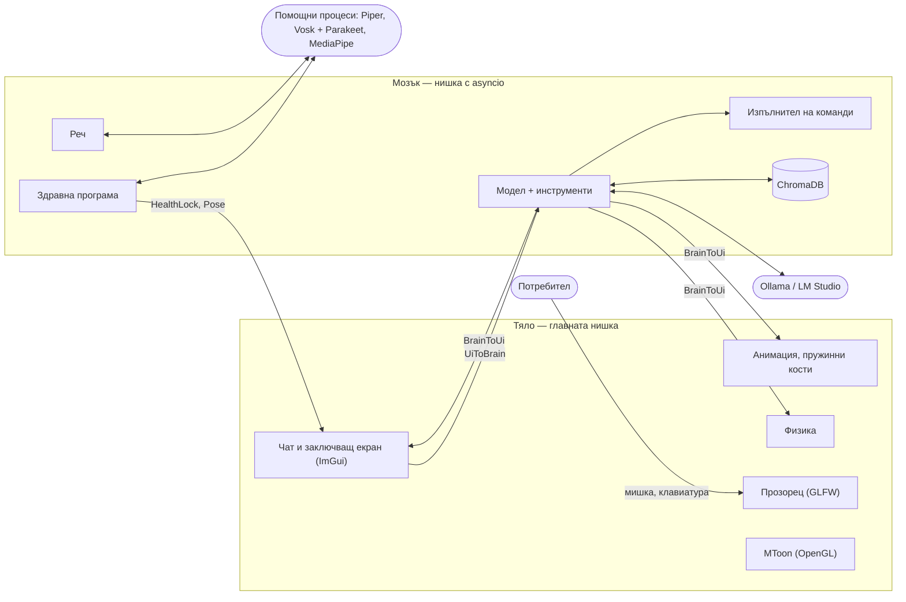

# Tomo — локален AI компаньон за работния плот (Windows и Linux)

**Tomo** е триизмерен персонаж във формат VRM (например създаден с VRoid
Studio), който живее върху работния плот. Тя ходи по „пода“ — лентата на
задачите в Windows или долния край на екрана в Linux, — може да бъде хваната с
мишката, разклатена и хвърлена, сяда, ляга да подремне и става сама. Разговаря
с потребителя с текст и глас, на английски и на български, и помага с
компютъра: отваря приложения, сменя силата на звука, изпълнява команди в
PowerShell или bash, поглежда екрана при нужда и разглежда снимките, които
потребителят ѝ изпрати.

Всички решения взема **езиков модел, който работи на самия компютър** —
**qwen3.5:9b** чрез Ollama (или друг модел чрез LM Studio). Гласът,
разпознаването на речта и камерата също работят локално. **Няма облачни
услуги и API ключове** — нищо от казаното или показаното не напуска
компютъра.

| | |
|---|---|
| **Език** | Python 3.11+ (препоръчва се 3.12), GLSL за шейдъра |
| **Платформи** | Windows 10/11 и Linux (X11, а под Wayland — чрез XWayland) |
| **Памет** | ChromaDB |
| **Графика** | GLFW + OpenGL 3.3 (moderngl) + Dear ImGui (imgui-bundle) |
| **Лиценз** | MIT |
| **Версия** | 0.2.0 |

---

## Съдържание

1. [Възможности](#1-възможности)
2. [Инсталация](#2-инсталация)
3. [Как се използва](#3-как-се-използва)
4. [Здравна програма](#4-здравна-програма)
5. [Настройки](#5-настройки)
6. [Архитектура](#6-архитектура)
7. [Структура на хранилището](#7-структура-на-хранилището)
8. [Сигурност и поверителност](#8-сигурност-и-поверителност)
9. [За разработчици: тестове и проверки](#9-за-разработчици-тестове-и-проверки)
10. [Известни грешки и ограничения](#10-известни-грешки-и-ограничения)
- [Приложение А. Инструментите на модела](#приложение-а-инструментите-на-модела)
- [Приложение Б. Паметта в ChromaDB](#приложение-б-паметта-в-chromadb)

---

## 1. Възможности

### Персонаж и движение

- **Прозрачен прозорец над всички останали.** В Windows прозорецът използва
  цветови ключ: чисто черното е „прозрачно“ и кликванията там стигат до
  прозорците отдолу. Мишката се улавя само от персонажа и от отворения чат.
- **Собствен физичен двигател.** Персонажът е твърдо тяло: може да бъде хванат
  за всяка точка, разклатен и хвърлен с въртене. Хваната за краката, виси с
  главата надолу. Ако се приземи неправилно, пада, полежава и става.
- **Самостоятелен живот.** Когато никой не я занимава, се разхожда, сяда и
  подремва.
- **Анимация, управлявана от физиката.** Ръцете и краката висят и се люлеят,
  издигат се при падане, коленете поддават при приземяване, тялото се накланя
  при потегляне. Дишане, походка, мигане, емоции, жестове (махане, кимане,
  свиване на рамене) и уста, която се движи, докато тя говори.
- **Пружинни кости** — косата и дрехите се поклащат; при хвърляне косата се
  развява.
- **MToon осветяване** — моделът изглежда така, както е създаден: цвят на
  сенките, рязка граница светлина/сянка, ръбова светлина, matcap и контури.

### Разговор и помощ с компютъра

- **Локален езиков модел** — **qwen3.5:9b** чрез Ollama: използва
  инструменти, говори английски и български, вижда изображения и на
  видеокарта с 8 GB работи изцяло на нея. Може и LM Studio (или друг
  OpenAI-съвместим сървър). Tomo сама намира работещия сървър.
- **Два езика.** Tomo разбира на какъв език е въпросът (по азбуката) и отговаря
  на същия; гласът следва езика на отговора.
- **„Течен“ чат.** Кликване върху персонажа → тя отива вдясно → от нея израства
  капка, която се превръща в прозорец за чат.
- **Снимки в чата.** Бутонът 📎, плъзгане на файлове върху чата (или върху
  нея) или Ctrl+V — снимка на екрана или копирани файлове. Моделът вижда
  снимката и получава от системата метаданните ѝ: къде е файлът, размер,
  дати, формат и EXIF (кога и къде е направена, с какъв апарат). Използва ги,
  когато помагат — например пътя до файла в команда.
- **„Hey Tomo“** — думата за събуждане се разпознава с Vosk, а казаното — с
  Parakeet (английски и български). Бутонът **Talk** записва без дума за
  събуждане.
- **Глас според езика и персонажа** — Piper: на български винаги **Dimitar**
  (`bg_BG-dimitar-medium`), на английски гласът на персонажа — **Alan**
  (`en_GB-alan-medium`) за мъжки и **Cori** (`en_GB-cori-medium`) за женски.
  Кой е персонажът решава моделът: при първата поява на нов персонаж той
  разглежда картинката му (миниатюрата във `.vrm` файла) и името и избира
  гласа с инструмента `set_voice`. Гласът може да бъде сменен и с молба
  („Use the male voice“, „Смени гласа на женски“).
- **Дългосрочна памет** в ChromaDB: предпочитания, факти, история на
  разговора. При първото стартиране старата SQLite памет се пренася
  автоматично.
- **Действия върху компютъра:** команди (PowerShell в Windows, bash в Linux),
  отваряне на приложения по име (включително от Microsoft Store), сила на
  звука, поглед към екрана, „видими“ кликвания и писане — всичко записано в
  одитен журнал и защитено ([раздел 8](#8-сигурност-и-поверителност)).
- **Смяна на персонажа** от менюто в чата, внос на произволен `.vrm` файл или
  просто с молба към Tomo.

### Здравна програма

С камера, на всеки час (или 3 часа след почивка) Tomo заключва работния плот
за една серия от 10 лицеви опори, 10 коремни преси и 10 клякания. Камерата
брои повторенията, Tomo брои на глас и повтаря движенията на потребителя като
огледало. Подробности — в [раздел 4](#4-здравна-програма).

---

## 2. Инсталация

### 2.1. Модел, с който Tomo мисли

На компютъра трябва да има сървър за езиков модел:

- **[Ollama](https://ollama.com/download)** и моделът на Tomo:
  `ollama pull qwen3.5:9b` (около 6,6 GB); или
- **[LM Studio](https://lmstudio.ai)** — изтеглете модел и пуснете локалния
  сървър.

**qwen3.5:9b** е добър в използването на инструменти, говори английски и
български и вижда изображения (снимките в чата, екрана, картинката на
персонажа при избора на глас). На видеокарта с 8 GB (например RTX 3070) работи
изцяло на нея и отговаря на прости въпроси за 1–2 секунди. Tomo използва
**един модел** — този в `TOMO_LLM_MODEL`; ако няма такъв — qwen3.5:9b, ако е
изтеглен, иначе първия локален модел. Модел, който не вижда изображения,
получава само метаданните на снимките.

### 2.2. Windows

1. Инсталирайте Ollama (или LM Studio).
2. Пуснете **`Tomo-Setup-<версия>.exe`** (от страницата *Releases* или като
   артефакт `Tomo-Setup-windows` от GitHub Actions). Инсталира се само за
   текущия потребител, без администраторски права, в
   `%LOCALAPPDATA%\Programs\Tomo`. Инсталаторът:
   - създава собствена Python среда (`.venv`) с **uv** — около 700 MB на диска;
   - по избор изтегля моделите за глас, „Hey Tomo“ и камерата (около 1 GB);
   - по избор изтегля `qwen3.5:9b` за Ollama (около 6,6 GB).
3. Стартирайте **Tomo** от менюто „Старт“. Настройките са в „Tomo settings“.

### 2.3. Linux

```bash
git clone https://github.com/NodeVortexGit/Tomo.git tomo
cd tomo
./install.sh
```

`install.sh` инсталира системните пакети (apt, dnf, pacman или zypper),
създава Python средата `.venv` (с uv, ако го има, иначе с venv и pip),
изтегля моделите за реч и камера, създава `.env` и добавя Tomo в менюто с
приложенията. Опции: `TOMO_SKIP_SYSDEPS=1`, `TOMO_SKIP_MODELS=1`,
`TOMO_MODEL=…`.

За прозрачния прозорец е нужен композитор (в X11: picom, kwin, mutter…).

### 2.4. От изходния код (за разработчици)

```bash
uv venv --python 3.12
uv pip install -r pyproject.toml --extra all --extra dev
python scripts/setup_models.py        # моделите за реч и камера (еднократно)
python -m tomo                        # стартира Tomo
```

(В Windows: `.venv\Scripts\python -m tomo`; без конзола — `pythonw -m tomo`.)
Допълненията `speech` и `camera` съдържат пакетите на помощните скриптове
(Piper, Vosk, Parakeet, OpenCV, MediaPipe); `all` включва и двете.

---

## 3. Как се използва

| Действие | Как |
|---|---|
| **Отваряне на чата** | Кликнете върху персонажа. Тя отива вдясно и чатът „изтича“ от нея. |
| **Затваряне на чата** | Бутонът ×, клавишът Escape, кликване другаде или ново кликване върху нея. |
| **Писане** | Полето „Say something…“ и Enter или „Send“. |
| **Изпращане на снимки** | Бутонът 📎 (до 4 снимки), плъзгане на файлове върху чата или върху нея (чатът се отваря), или Ctrl+V в отворения чат. Снимките чакат над полето — кликване върху някоя я маха. Кликване върху снимка в разговора я отваря. |
| **Говорене** | „Hey Tomo, …“ или бутонът „Talk“. |
| **Без глас** | Бутонът с високоговорителя в чата. |
| **Смяна на гласа** | С молба: „Use the male voice“, „Смени гласа на женски“. |
| **Смяна на персонажа** | Бутонът с човечето → изберете модел или „Import a .vrm…“. Може и с думи. |
| **Хващане и хвърляне** | Натиснете върху нея, влачете и пуснете в движение. |
| **Изход** | Бутонът за изключване в чата. |
| **Спешно спиране на управлението** | Клавишът Pause или Ctrl+Alt+Esc. |

Примери за молби: „Wave at me!“, „Колко е часът?“, „Отвори Word, Excel и
PowerPoint“, „Намали звука на 30“, „Какво пише на екрана ми?“, „Запомни, че
уча Python“.

Проверка на модела без прозорец (командите се изпълняват само с `--run`):

```bash
python -m tomo ask "Колко е часът?"
python -m tomo ask --run "Колко свободно място има на диска?"
python -m tomo ask --speak "кажи здравей"
python -m tomo ask --image снимка.jpg "Кога и къде е направена?"
```

---

## 4. Здравна програма

Програмата се включва сама, когато има камера, и **не може да бъде
изключена**. Без камера е изключена и се включва, щом камера се появи. В нея
няма изкуствен интелект: малкият модел MediaPipe Pose Lite (на процесора)
превръща кадрите в 33 стави, а всичко останало е геометрия и правила.

- **Серия:** 10 лицеви опори, 10 коремни преси, 10 клякания. Повторението е
  ъгъл в ставата (лакти, таз, колене), който слиза под един праг и се връща
  над друг.
- **Кога:** един час след последната серия (или след стартиране). Ако
  потребителят стане или излезе от кадър за **30 секунди**, това е почивка и
  следващата серия е **3 часа** след нея.
- **Заключване:** прозорецът покрива всички екрани, а в Windows клавиатурата
  е задържана (Win, Alt+Tab, Alt+F4…). Изход има само през **Ctrl+Alt+Del**
  (Windows не позволява да бъде прихванат) и при **загуба на камерата**.
  Рестартът не помага: незавършена серия продължава при следващото
  стартиране (`health.json` в папката с данни).
- **Огледало:** Tomo застава в средата, голяма, и повтаря позата на
  потребителя като огледален образ — снижава се с таза му при клякане и
  лицевата опора.
- **Броене на глас:** Tomo брои всяко повторение и обявява следващото
  упражнение, без гласовете да се застъпват.

---

## 5. Настройки

Всички настройки са във файла `.env` (образец: `.env.example`).
Стойностите по подразбиране работят.

| Ключ | По подразбиране | Описание |
|---|---|---|
| `TOMO_LLM` | `auto` | `auto` (Ollama, иначе LM Studio), `ollama`, `lmstudio` или `openai` |
| `TOMO_LLM_URL` | обичайният адрес | напр. `http://127.0.0.1:11434` |
| `TOMO_LLM_MODEL` | `qwen3.5:9b` | единственият модел на Tomo (празно: qwen3.5:9b, ако го има, иначе първият локален) |
| `TOMO_LLM_CONTEXT` | `8192` | колко от разговора чете моделът (токени, Ollama) |
| `TOMO_LLM_THINK` | `false` | „мислене“ преди отговора (по-бавно) |
| `TOMO_LLM_KEEP_ALIVE` | `1h` | колко дълго Ollama държи модела зареден |
| `TOMO_LLM_API_KEY` | — | само ако сървърът иска ключ |
| `TOMO_TTS_VOICE_MALE` | `en_GB-alan-medium` | английският глас на мъжките персонажи |
| `TOMO_TTS_VOICE_FEMALE` | `en_GB-cori-medium` | английският глас на женските персонажи (и докато моделът не е избрал) |
| `TOMO_TTS_VOICE_BG` | `bg_BG-dimitar-medium` | българският глас — за всеки персонаж |
| `TOMO_TTS_SPEED` | `1.0` | скорост на речта |
| `TOMO_WAKE_WORD` | `true` | слушане за „Hey Tomo“ |
| `TOMO_PERSONA` | `Tomo` | името на персонажа |
| `TOMO_CHARACTER` | приложеният модел | `.vrm` за показване при първото стартиране |
| `TOMO_EMBEDDINGS` | `ngram` | търсене в паметта: `ngram` (вградено, всеки език) или `minilm` |
| `TOMO_ALLOW_COMMANDS` | `true` | главният превключвател за команди и управление |
| `TOMO_EXTRA_ALLOWED` | — | допълнителни доверени префикси на команди |
| `TOMO_ALLOW_SCREEN` | `true` | може ли моделът да вижда екрана |
| `TOMO_GLFW_PLATFORM` | `x11` | Linux: `wayland` за собствен Wayland прозорец |
| `TOMO_DATA_DIR` | папката на системата | памет, модели, журнали |
| `TOMO_SCRIPTS_DIR` | `scripts/` | помощните скриптове |
| `TOMO_LOG` | `info` | подробност на `tomo.log` (`debug` за повече) |
| `TOMO_ROOT` | — | къде са `.env` и `scripts/` (ако не е текущата папка) |

Папката с данни е `%APPDATA%\tomo\tomo\data` в Windows и
`~/.local/share/tomo` в Linux. В нея са паметта (`chroma/`), копията на
изпратените снимки (`attachments/`), гласовете (`voices/`), моделите за реч и
камера (`models/`), `health.json`, `command-audit.log` и `tomo.log`.

---

## 6. Архитектура

### 6.1. „Мозък“ и „тяло“

Програмата има две половини, които не споделят състояние, а само си
разменят съобщения (`tomo/events.py`):

- **Мозъкът** (`tomo/*.py`) работи в собствена нишка с `asyncio`: езиковият
  модел и инструментите му, паметта, речта, командите, здравната програма.
- **Тялото** (`tomo/body/*.py`) работи в главната нишка: прозорецът,
  изобразяването, физиката, анимацията, чатът и заключващият екран.



- **`UiToBrain`** (тяло → мозък): `UserMessage` (текстът и снимките към
  него), `StartVoiceInput`, `ImportCharacter`, `SetVoice`, `PanicStop`,
  `Shutdown`…
- **`BrainToUi`** (мозък → тяло): `Chat`, `WalkTo`, `Emote`, `Animate`,
  `Thinking`, `Listening`, `Speaking`, `LoadCharacter`, `ClickAt`,
  `HealthLock`, `HealthProgress`, `Pose`…

Тялото изпразва опашката от мозъка веднъж на кадър, затова изобразяването
никога не чака модела, базата данни или речта.

### 6.2. Нишки и процеси

| Нишка / процес | Какво прави |
|---|---|
| **Главна нишка** | Прозорецът, кадрите, мишката и клавиатурата (GLFW изисква главната нишка). |
| **`tomo-brain`** | `asyncio`: заявки към модела (httpx), памет, команди, реч, здравна програма. |
| **`tomo-load-character`** | Чете нов `.vrm` във фонов режим; качването към видеокартата е в главната нишка. |
| **`tomo-thumbnails`** | Чете и смалява снимките за чата; текстурите се качват в главната нишка. |
| **`tomo-keyboard-hold`** | Само в Windows, по време на серия: задържа клавиатурата. |
| **`scripts/tts_piper.py`** | Гласът: зарежда гласовете веднъж и превръща всеки ред текст в WAV. |
| **`scripts/wake_word.py`** | „Hey Tomo“ и „Talk“: Vosk + Parakeet, връща текста като JSON редове. |
| **`scripts/pose.py`** | Камерата: MediaPipe Pose Lite, връща ставите като JSON редове. |
| **Ollama / LM Studio** | Отделна програма на същия компютър, която изпълнява модела. |

Помощните скриптове работят със същия Python интерпретатор като Tomo.

### 6.3. Основни решения

- **Изобразяване.** Собствен четец на glTF/VRM (`vrm.py`), скелетна анимация
  на видеокартата (матриците на ставите са в текстура), изразите на лицето се
  смесват на процесора само когато се променят, MToon е пренесен в GLSL
  (`mtoon.glsl`), контурите са втора, разширена по нормалите рисунка на
  мрежата. Камерата е ортографска: една световна единица е един логически
  пиксел.
- **Нормализиран скелет.** Позите са в осите на модела спрямо T-позата и се
  превръщат в локални завъртания по формулата `P⁻¹ · Q · P · L`, затова една
  и съща поза пасва на всеки VRM 1.0 модел.
- **Физика.** Твърдо тяло в равнината на екрана: капсула, импулси с
  еластичност и триене, подстъпки от най-много 1/240 s; крайниците са
  махала в „усещаното“ поле (гравитация минус ускорението на тялото).
- **Пружинни кости.** Интегриране на Верле по спецификацията
  `VRMC_springBone`; за скорост всички вериги се пресмятат едновременно, ниво
  по ниво, с numpy.
- **Модел с инструменти.** До 6 кръга с инструменти, общо до 60 s на ход.
  Защити срещу малките модели: напомняне, когато моделът само обещава, без
  да действа; проверка, когато твърди успех, който резултатите не
  потвърждават; разпознаване на извиквания, написани в текста; премахване на
  `<think>` бележките. В началото на всеки ход моделът получава и описание на
  компютъра (`sysinfo.py`: система, версия, архитектура, компютър,
  потребител), за да не го проучва с команди.
- **Снимки.** Мозъкът прави свое копие на всяка изпратена снимка (изправена
  по EXIF, до 1280 px, JPEG) в `attachments/` и чете метаданните ѝ
  (`attachments.py`). Моделът вижда самите снимки само от последното
  съобщение със снимки — така може да се питат и уточняващи въпроси, — а за
  по-старите получава само бележките.
- **Гласове.** Изборът е обикновено `if/elif/else` в `speech.py`: български →
  Dimitar; иначе мъжки персонаж → Alan; иначе → Cori. Кой персонаж е мъжки
  или женски пази паметта (колекцията `characters`), а го решава моделът —
  веднъж, при първата поява, по картинката и името на персонажа. Помощният
  процес на Piper зарежда трите гласа при стартиране, така че смяната на
  персонажа или езика не чака.
- **Кадри.** При движение — честотата на монитора; в покой — 24 кадъра в
  секунда.

---

## 7. Структура на хранилището

```
tomo/
├── tomo/                     # приложението
│   ├── __main__.py           #  стартиране: python -m tomo (и tomo ask …)
│   ├── config.py             #  настройките от .env
│   ├── events.py             #  съобщенията между мозъка и тялото
│   ├── brain.py              #  главният цикъл на мозъка
│   ├── ai.py                 #  езиковият модел и инструментите му
│   ├── attachments.py        #  изпратените снимки и метаданните им
│   ├── sysinfo.py            #  описанието на компютъра за модела
│   ├── db.py                 #  паметта (ChromaDB)
│   ├── commands.py           #  защитеното изпълнение на команди
│   ├── apps.py               #  инсталираните приложения
│   ├── volume.py             #  силата на звука
│   ├── screen.py             #  екранни снимки
│   ├── speech.py             #  гласът (Piper): кой глас за кой ред
│   ├── wake.py               #  „Hey Tomo“ и „Talk“
│   ├── language.py           #  английски или български
│   ├── characters.py         #  наличните персонажи и гласовете им
│   ├── health.py             #  здравната програма
│   ├── platform.py           #  разликите между Windows и Linux
│   ├── ask.py                #  въпрос към модела от терминала
│   └── body/                 #  тялото
│       ├── app.py            #   главният цикъл на кадрите
│       ├── window.py         #   прозорецът (GLFW) и средата
│       ├── vrm.py            #   четене на .vrm
│       ├── skeleton.py       #   позираният модел
│       ├── renderer.py       #   изобразяването (moderngl)
│       ├── mtoon.py, mtoon.glsl  # MToon материалът и шейдърът
│       ├── movement.py       #   физиката
│       ├── animation.py      #   пози, жестове, лице, огледало
│       ├── springs.py        #   пружинните кости
│       ├── ui.py             #   Dear ImGui върху moderngl
│       ├── chat.py           #   чатът
│       ├── workout.py        #   заключващият екран на здравната програма
│       ├── control.py        #   „видими“ кликвания и писане
│       └── mathx.py          #   вектори, кватерниони, матрици
├── scripts/                  # помощните процеси
│   ├── tts_piper.py          #  гласът: текст → WAV
│   ├── wake_word.py          #  „Hey Tomo“ и „Talk“
│   ├── pose.py               #  камерата → ставите
│   └── setup_models.py       #  изтегляне на моделите
├── tests/                    # тестовете (pytest)
├── assets/characters/        # VRM моделите
├── packaging/windows/        # инсталаторът за Windows (Inno Setup)
├── .github/workflows/        # CI: тестове и инсталатор
├── drafts/                   # чернови: описанията на модулите за екипа
├── install.sh                # инсталаторът за Linux
├── pyproject.toml            # пакетите и зависимостите
└── .env.example              # образецът на настройките
```

Папката **`drafts/`** (чернови) съдържа по един `.txt` файл за всеки модул —
описание за членовете на екипа: какво прави модулът, как работи и с кои
други модули е свързан. `drafts/00-обзор.txt` е началото.

---

## 8. Сигурност и поверителност

### Поверителност

- Моделът, гласът, разпознаването на речта и камерата работят **на
  компютъра**. Съобщенията, спомените, снимките на екрана и кадрите от
  камерата не напускат компютъра.
- Кадрите от камерата не се записват — използват се само ставите.
- Екранни снимки се правят само при разрешение (`TOMO_ALLOW_SCREEN`), и всеки
  поглед се отбелязва в чата.
- Изпратените снимки и метаданните им (включително GPS координатите от EXIF)
  стигат само до локалния модел. Копията им остават в `attachments/` в
  папката с данни, за да се виждат в историята на чата.
- Интернет е нужен само при инсталацията (пакети и модели) и при първото
  използване на нов глас на Piper.

### Изпълнение на команди — защита на няколко нива

1. **Главен превключвател** (`TOMO_ALLOW_COMMANDS=false`): нищо не се
   изпълнява, само се записва какво би било изпълнено.
2. **Твърд черен списък**, който не може да се изключи: форматиране и
   изтриване на дискове, изтриване на системни папки и корена, промени в
   зареждането (`bcdedit`), изтриване на резервни копия, изтриване на
   системни ключове в регистъра, изпълнение на изтеглен код
   (`iwr … | iex`, `curl … | sh`), „fork bomb“.
3. **Одитен журнал** — всяка команда се записва с час в `command-audit.log`.
4. **Ограничение на времето** — 20 s на команда.
5. **Честност** — отказана команда се връща на модела с думите „Nothing was
   done“, за да не твърди, че е успял.

„Видимите“ кликвания и писане (`click_at`, `type_text`) показват червен знак,
докато траят, и спират веднага с клавиша Pause (или Ctrl+Alt+Esc).

---

## 9. За разработчици: тестове и проверки

```bash
python -m pytest -q
```

149 теста покриват: паметта (ChromaDB, пренасянето от SQLite), модела и
инструментите (с фалшив сървър Ollama и LM Studio), избора на глас от модела
и `if/elif/else` на гласовете, снимките (копие, изправяне по EXIF,
метаданни, GPS, поставяне от клипборда), командите и черния списък,
приложенията, силата на звука, речта, езика, здравната програма (броене,
почивки, график, пълна серия с фалшива камера), физиката (16 сценария),
пружинните кости (включително на истинските модели), анимацията и
огледалото, чата, управлението и разпознаването на средата.

GitHub Actions (`.github/workflows/build.yml`) пуска тестовете на Linux и
Windows и сглобява инсталатора за Windows; при етикет `v*` го прикача към
издание.

Тестови куки (само в режим за разработка на Python, `python -X dev`):
`TOMO_POSE_REPLAY=joints.jsonl` пуска записани стави вместо камерата, а
`TOMO_HEALTH_DUE_IN=10` пуска серия след 10 секунди.

---

## 10. Известни грешки и ограничения

### Известни грешки

**Чатът закрива персонажа (не е поправено).** Когато чатът се отвори, Tomo
отива вдясно и спира с център на 86 % от ширината на екрана
(`DOCK_FRACTION = 0.86` в `tomo/body/chat.py`). Прозорецът на чата
(340 × 460 логически пиксела) е закрепен до десния край на екрана (на 24 px
от него) и центриран по вертикала (`panel_rect()` в същия файл). Двете места
се изчисляват независимо едно от друго, затова персонажът застава точно под
панела и панелът закрива част от него:

- на екран 1920×1080 при мащаб 100 % (работна площ 1920×1032) панелът е
  между y = 286 и 746 px, а персонажът (висок 320 px) — между 712 и 1032 px:
  закрит е върхът на главата му (около 34 px);
- на по-нисък или мащабиран екран — например 1366×768 или 1920×1080 при
  150 % — панелът закрива главата и повече от половината от тялото.

Възпроизвеждане: стартирайте Tomo и кликнете върху персонажа — след като
чатът се оформи, горната част на персонажа е под долния край на панела.

### Ограничения

- **Linux:** под Wayland Tomo използва XWayland (X11). С
  `TOMO_GLFW_PLATFORM=wayland` работи и като собствен Wayland прозорец, но
  тогава кликванията не минават през празните места и прозорецът може да не
  е „винаги отгоре“. GNOME на Wayland не позволява „винаги отгоре“.
- **Windows:** прозрачността е чрез цветови ключ, затова ръбовете на
  персонажа са без полупрозрачност.
- Заключването на клавиатурата при здравната програма е само в Windows.
- **VRM 0.x** моделите се показват, но не се анимират.
- Малките модели (0.5–3 милиарда параметъра) грешат по-често при използване
  на инструменти.
- Piper има само един български глас (Dimitar, мъжки), затова на български
  всички персонажи говорят с него.
- В Linux поставянето на снимки с Ctrl+V изисква `wl-paste` (Wayland) или
  `xclip` (X11).
- „Течната“ капка е от кръгове, а не истински течен шейдър.

---

## Приложение А. Инструментите на модела

| Инструмент | Какво прави |
|---|---|
| `execute_command` | Изпълнява команда (PowerShell в Windows, bash в Linux) през защитения изпълнител. Изходът отива само при модела. |
| `remember` | Запомня факт за потребителя. |
| `set_preference` | Запазва предпочитание (ключ и стойност). |
| `recall` | Търси в паметта. |
| `walk_to` | Отива до място по долния край на екрана. |
| `express` | Изражение на лицето. |
| `animate` | Жест или движение: wave, nod, shrug, sit, lie_down, jump, idle. |
| `change_character` | Сменя персонажа; без име връща списъка. |
| `set_voice` | Избира английския глас на персонажа: `male` (Alan) или `female` (Cori); българският е винаги Dimitar. Моделът го извиква сам при нов персонаж и при молба. |
| `list_apps` | Търси в инсталираните приложения. |
| `open_app` | Отваря приложение по име. |
| `set_volume` | Задава, променя или спира звука (проверена команда за всяка система). |
| `look_at_screen` | Поглежда екрана (при разрешение). |
| `find_on_screen` | Намира нещо на екрана за `click_at`. |
| `click_at` | Кликва с истинската мишка (при разрешено управление). |
| `type_text` | Пише с истинската клавиатура (при разрешено управление). |
| `toggle_system` | Само в Linux: Bluetooth, Wi‑Fi, звук. |

## Приложение Б. Паметта в ChromaDB

Паметта е в `chroma/` в папката с данни (`chromadb.PersistentClient`, без
телеметрия).

| Колекция | Съдържание |
|---|---|
| `preferences` | Предпочитания на потребителя (ключ → стойност) |
| `memories` | Спомени с вид и важност 1–5; търсят се по думи и по сходство |
| `messages` | Историята на разговора, по ред, със снимките към съобщенията (копие, оригинален път, метаданни) |
| `characters` | Внесените персонажи, кой е избран и гласът на всеки (`male`/`female`) |
| `snapshots` | Кеш на каталога с приложения и други служебни записи |

Сходството се изчислява с вградени n-грамни вектори (работят без интернет и
на всеки език); с `TOMO_EMBEDDINGS=minilm` се използва английският модел на
ChromaDB.
