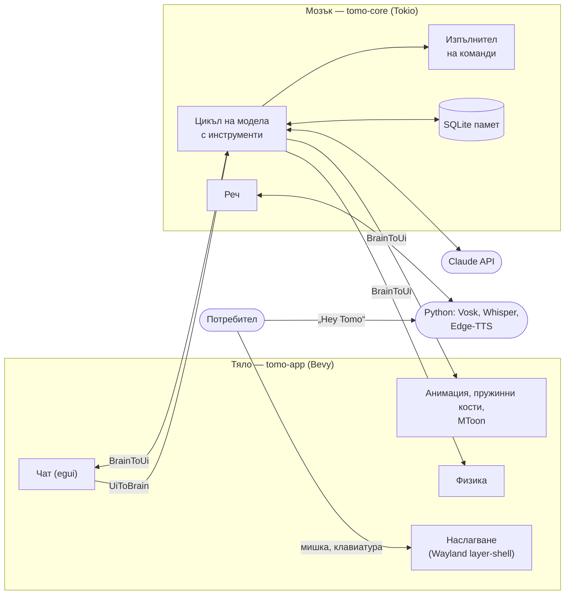
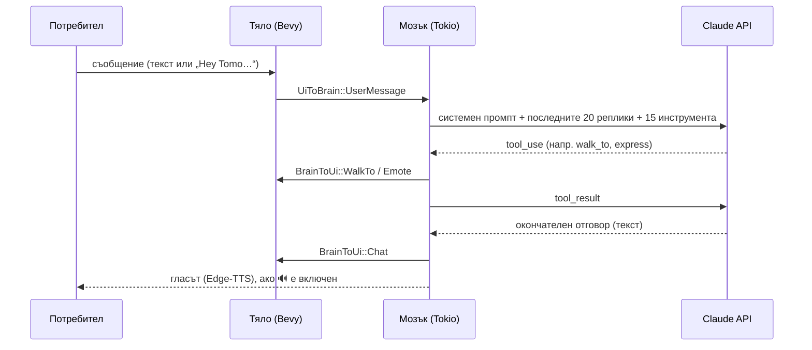

# Tomo — AI компаньон за работния плот на Linux

**Техническа документация**

| | |
|---|---|
| **Проект** | Tomo — 3D персонаж (VRM), който живее върху работния плот и се управлява от изкуствен интелект |
| **Автор** | NodeVortex ([github.com/NodeVortexGit](https://github.com/NodeVortexGit)) |
| **Хранилище** | [github.com/NodeVortexGit/Tomo](https://github.com/NodeVortexGit/Tomo) |
| **Езици** | Rust, WGSL (шейдъри), Python, Bash |
| **Платформа** | Linux (разработен и тестван на Arch Linux с Hyprland/Wayland) |
| **Лиценз** | MIT |
| **Версия** | 0.1.0, септември 2026 г. |

---

## Съдържание

1. [Резюме](#1-резюме)
2. [Цели на проекта](#2-цели-на-проекта)
3. [Основни възможности](#3-основни-възможности)
4. [Използвани технологии](#4-използвани-технологии)
5. [Архитектура](#5-архитектура)
6. [Описание на модулите](#6-описание-на-модулите)
7. [Ключови алгоритми и решения](#7-ключови-алгоритми-и-решения)
8. [Инсталация](#8-инсталация)
9. [Конфигурация](#9-конфигурация)
10. [Ръководство за потребителя](#10-ръководство-за-потребителя)
11. [Сигурност и поверителност](#11-сигурност-и-поверителност)
12. [Тестване и качество](#12-тестване-и-качество)
13. [Производителност](#13-производителност)
14. [Известни ограничения](#14-известни-ограничения)
15. [Бъдещо развитие](#15-бъдещо-развитие)
16. [Заключение](#16-заключение)
- [Приложение А. Инструментите на изкуствения интелект](#приложение-а-инструментите-на-изкуствения-интелект)
- [Приложение Б. Структура на базата данни](#приложение-б-структура-на-базата-данни)

---

## 1. Резюме

**Tomo** е компаньон за работния плот на Linux: триизмерен персонаж във формат
VRM (например създаден с VRoid Studio), който живее върху екрана. Той ходи по
„пода“ — долния край на екрана, може да бъде хванат с мишката, разклатен и
хвърлен. Сяда, ляга да подремне и става сам. Разговаря с потребителя с текст
и глас.

Всички решения се вземат от езиковия модел **Claude** (Anthropic) чрез
механизма за използване на инструменти (*tool use*): какво да каже, къде да
отиде, какво изражение да покаже, какво да запомни и кои команди да изпълни.
Програмата изпълнява решенията на модела. Нищо от поведението в разговора не е
предварително записано.

Проектът е написан на **Rust** с игровия двигател **Bevy**, с малки помощни
скриптове на **Python** (реч) и **Bash** (инсталация). Той се състои от два
компонента:

- **„мозък“** (`tomo-core`): изкуствен интелект, памет, реч, изпълнение на
  команди. Няма графични зависимости и е покрит с модулни тестове.
- **„тяло“** (`tomo-app`): изобразяване, физика, анимация и потребителски
  интерфейс.

---

## 2. Цели на проекта

1. **Персонаж, който не е прозорец.** Tomo плава над всички прозорци, без да
   пречи на работата: кликванията върху празните места преминават към
   прозорците отдолу.
2. **Правдоподобно движение.** Движението идва от малък физичен двигател, а не
   от предварително записани анимации. Персонажът пада, преобръща се, люлее се,
   когато го носят, и се изправя сам.
3. **Естествен разговор.** Текст и глас, дума за събуждане „Hey Tomo“ и синтез
   на реч.
4. **Дългосрочна памет.** Tomo помни предпочитанията и фактите за потребителя
   между отделните стартирания.
5. **Помощ с компютъра, безопасно и прозрачно.** Отваряне на приложения,
   включване и изключване на Bluetooth, Wi‑Fi и звук, поглед към екрана при
   нужда. Всяко действие се записва и може да бъде забранено.
6. **Поддръжка на чужди модели.** Всеки VRM 1.0 модел се показва с неговите
   собствени настройки: скелет, изражения, пружинни кости, MToon осветяване.
7. **Ниско натоварване.** Персонажът е включен постоянно, затова в покой
   използва около 13% от едно процесорно ядро.

---

## 3. Основни възможности

### Персонаж и движение

- **Прозрачно наслагване** над всички прозорци чрез протокола *wlr-layer-shell*
  (Hyprland, Sway, KDE). Мишката се улавя само от персонажа и от отворения чат.
- **Физика на твърдо тяло.** Персонажът може да бъде хванат за всяка точка. Хванат
  за краката, той виси с главата надолу. Може да бъде разклатен и хвърлен с
  въртене. Ако се приземи неправилно, пада, полежава и става.
- **Самостоятелен живот.** Когато никой не го занимава, персонажът се разхожда,
  сяда и подремва.
- **Анимация, управлявана от физиката.** Ръцете и краката висят и се люлеят,
  когато го носят. Издигат се при падане. Коленете поддават при приземяване.
  Тялото се накланя, когато тръгва.
- **Дишане, походка, мигане, емоции и жестове** (махане, кимане, свиване на
  рамене). Устата се движи, докато персонажът говори.
- **Пружинни кости** (*spring bones*). Косата се развява при хвърляне и пада
  надолу, когато персонажът виси. Полата и панделките се поклащат.
- **MToon осветяване.** Моделът изглежда така, както е създаден: цветове за
  сенките, рязка граница между светлина и сянка, ръбова светлина, отблясъци в
  косата и контури.

### Изкуствен интелект и разговор

- **Claude Sonnet 5** чрез Anthropic Messages API, с кеширане на промпта и
  повторни опити при претоварване.
- **15 инструмента**, с които моделът действа: ходене, изражения, жестове,
  памет, команди, приложения, поглед към екрана и други
  ([Приложение А](#приложение-а-инструментите-на-изкуствения-интелект)).
- **„Течен“ прозорец за чат.** Кликване върху персонажа го кара да отиде вдясно.
  От него израства капка, която се превръща в прозорец за чат с последните
  реплики от разговора.
- **Дългосрочна памет** в SQLite: предпочитания, факти, история на разговора.

### Реч

- **„Hey Tomo“.** Думата за събуждане се разпознава изцяло локално (Vosk), без
  звукът да напуска компютъра. Заявката също се превръща в текст локално
  (Whisper).
- **Синтез на реч** с невронните гласове на Microsoft Edge. Markdown и емоджита
  не се четат на глас. Бутонът 🔊 изключва гласа.

### Работа с компютъра

- **Каталог на инсталираните приложения** от `.desktop` файловете, включително
  Flatpak, и на наличните системни превключватели (Bluetooth, Wi‑Fi, звук).
- **Изпълнение на команди**, защитено с главен превключвател, черен списък от
  опасни команди, одитен журнал и ограничение на времето.
- **Поглед към екрана.** С разрешение моделът може да види екранна снимка.
  Всеки поглед се отбелязва в чата.

### Персонализация

- **Избор на персонаж** от менюто 👤 в чата, внос на произволен `.vrm` файл или
  просто молба към Tomo да се преоблече. Изборът се запомня.
- **Всички настройки** са на едно място — файла `.env`.

---

## 4. Използвани технологии

| Технология | Версия | За какво се използва |
|---|---|---|
| **Rust** (издание 2021) | 1.98 | Основен език за двата компонента |
| **Bevy** | 0.15 | Игров двигател: ECS, изобразяване (wgpu/Vulkan), glTF, скелетна анимация |
| **bevy_egui** / egui | 0.31 | Прозорецът за чат |
| **smithay-client-toolkit** | 0.19 | Wayland: layer-shell повърхност, мишка, клавиатура (xkbcommon) |
| **WGSL** | — | Шейдърът за MToon осветяването |
| **Tokio** | 1 | Асинхронното изпълнение на „мозъка“ |
| **reqwest** (rustls) | 0.12 | HTTPS заявки към Anthropic Messages API |
| **rusqlite** (вграден SQLite) | 0.32 | Дългосрочната памет |
| **serde / serde_json** | 1 | JSON: API, glTF/VRM разширения |
| **image**, **base64** | 0.25 / 0.22 | Мащабиране и кодиране на екранни снимки |
| **dotenvy**, **directories** | — | Конфигурация от `.env`, XDG пътища |
| **tracing** | — | Журнал на събитията |
| **Python 3** + **edge-tts** | ≥ 6.1.9 | Синтез на реч |
| **Vosk** (+ модел small-en-us 0.15) | ≥ 0.3.41 | Локално откриване на „Hey Tomo“ |
| **faster-whisper** (+ модел base.en) | ≥ 1.1 | Локално превръщане на заявката в текст |
| **Claude Sonnet 5** | — | Езиковият модел, който взема решенията |
| **grim** / spectacle / maim и др. | — | Екранни снимки |
| **parecord** / pw-record / arecord | — | Запис от микрофона |
| **mpv** / ffplay / paplay | — | Възпроизвеждане на речта |

---

## 5. Архитектура

### 5.1. Два компонента: „мозък“ и „тяло“



Двата компонента не споделят състояние. Те обменят само съобщения по два
канала:

- **`UiToBrain`** — от тялото към мозъка. Примери: потребителят написа нещо
  (`UserMessage`), натисна „Talk“, избра персонаж (`ImportCharacter`),
  включи или изключи гласа (`SetVoice`) или затвори програмата (`Shutdown`).
- **`BrainToUi`** — от мозъка към тялото. Примери: нов ред в чата (`Chat`),
  „отиди до…“ (`WalkTo`), изражение (`Emote`), жест (`Animate`), „мисля“
  (`Thinking`), „слушам“ (`Listening`), „говоря“ (`Speaking`), зареди модел
  (`LoadCharacter`), списък с персонажи (`Characters`).

Така цикълът на изобразяване никога не чака мрежата, модела, базата данни или
синтеза на реч.

### 5.2. Нишки и процеси

| Нишка / процес | Какво прави |
|---|---|
| **Главна нишка** | Bevy. Собствен цикъл върху събитията на Wayland (calloop) вместо стандартния winit. |
| **Нишка за изобразяване** | Подготвя и изпраща кадрите към видеокартата (конвейерно изобразяване в Bevy). |
| **Нишка „tomo-brain“** | Tokio с 2 работни нишки: заявки към Claude, база данни, команди, реч. |
| **`wake_word.py`** | Отделен Python процес. Постоянно слуша за „Hey Tomo“ и връща разпознатия текст по JSON редове. |
| **`tts_edge.py`** | Кратък Python процес за всяка реплика: текст → mp3 файл. |

### 5.3. Структура на хранилището

```
tomo/
├── install.sh                 # инсталатор (apt / dnf / pacman / zypper)
├── .env.example               # образец на настройките
├── crates/
│   ├── tomo-core/             # МОЗЪКЪТ — без графика, с модулни тестове
│   │   ├── src/
│   │   │   ├── config.rs      #  зареждане на .env и XDG пътища
│   │   │   ├── db.rs          #  SQLite памет
│   │   │   ├── ai.rs          #  цикълът на Claude с инструменти
│   │   │   ├── characters.rs  #  наличните .vrm модели и смяната им
│   │   │   ├── apps.rs        #  приложения и системни превключватели
│   │   │   ├── commands.rs    #  защитеното изпълнение на команди
│   │   │   ├── screen.rs      #  екранни снимки за модела
│   │   │   ├── speech.rs      #  синтез и разпознаване на реч
│   │   │   ├── wake.rs        #  процесът „Hey Tomo“
│   │   │   ├── events.rs      #  съобщенията между мозъка и тялото
│   │   │   └── brain.rs       #  главният цикъл на мозъка
│   │   └── examples/ask.rs    #  проверка на ключа и модела от терминала
│   └── tomo-app/              # ТЯЛОТО — приложение на Bevy
│       └── src/
│           ├── main.rs        #  сглобяване на приложението
│           ├── overlay.rs     #  прозрачното наслагване (Wayland)
│           ├── window.rs      #  резервен режим с обикновен прозорец
│           ├── session.rs     #  разпознаване на средата (X11/Wayland, DE)
│           ├── character.rs   #  зареждане и измерване на VRM модела
│           ├── movement.rs    #  физиката
│           ├── animation.rs   #  скелет, пози, изражения
│           ├── springs.rs     #  пружинните кости
│           ├── mtoon.rs       #  MToon материалът
│           ├── mtoon.wgsl     #  MToon шейдърът
│           ├── chat.rs        #  прозорецът за чат
│           ├── input.rs       #  „видими“ кликвания (по избор)
│           └── bridge.rs      #  каналите мозък ⇄ тяло
├── scripts/
│   ├── wake_word.py           # „Hey Tomo“ (Vosk + Whisper)
│   ├── tts_edge.py            # текст → реч (Edge-TTS)
│   ├── stt_google.py          # резервно разпознаване на реч (Google)
│   └── requirements.txt
└── assets/characters/         # VRM моделите
```

---

## 6. Описание на модулите

### 6.1. Мозъкът (`tomo-core`)

| Модул | Описание |
|---|---|
| **`config.rs`** | Чете `.env` (от папката на проекта и от текущата папка) и променливите на средата. Попълва стойности по подразбиране и XDG пътищата (`~/.local/share/tomo`). Ключовете не се записват в журнала: `redacted()` дава безопасен изглед. Ако ред в `.env` не може да се прочете, предупреждението не повтаря самия ред, защото той може да съдържа ключ. |
| **`db.rs`** | SQLite база данни с предпочитания, спомени (с важност 1–5), история на разговора, персонажи и кеш на каталога ([Приложение Б](#приложение-б-структура-на-базата-данни)). |
| **`ai.rs`** | Цикълът с инструменти. Сглобява системния промпт (характер, предпочитания, най-важните 15 спомена, наличните приложения) и историята (последните 20 реплики). Изпраща заявката към Claude. Изпълнява поисканите инструменти и връща резултатите им, докато моделът не даде окончателен отговор (най-много 6 кръга). При грешки 429 и 5xx прави повторни опити с нарастващо изчакване. |
| **`characters.rs`** | Намира наличните `.vrm` модели в папката на зададения персонаж, в `~/.local/share/tomo/characters` и в базата данни. Сменя персонажа и запомня избора. Файл от друго място първо се копира в папката с данни. |
| **`apps.rs`** | Прочита `.desktop` файловете (системните, потребителските и тези на Flatpak) и съставя списък с приложения. Проверява кои програми за превключватели има: `rfkill` или `bluetoothctl` за Bluetooth, `nmcli` за Wi‑Fi, `wpctl` или `pactl` за звук. Сканира при стартиране и след това периодично, като обновява данните само при промяна (по „отпечатък“). |
| **`commands.rs`** | Изпълнителят на команди: главен превключвател, твърд черен списък, одитен журнал, 20-секундно ограничение ([раздел 11](#11-сигурност-и-поверителност)). |
| **`screen.rs`** | Прави екранна снимка с първия работещ инструмент (grim, spectacle, gnome-screenshot, maim, scrot, import). Смалява я до най-много 1920 px по дългата страна и я кодира като JPEG. |
| **`speech.rs`** | Синтез на реч (Edge-TTS → mp3 → mpv/ffplay/paplay). Преди синтеза `speakable()` премахва Markdown маркерите и емоджитата, оставя само думите на връзките и слага пауза в края на всеки ред. Съдържа и резервното разпознаване на реч с Google STT. |
| **`wake.rs`** | Стартира и наблюдава `wake_word.py`. Изпраща му команди (`listen`, `mute`, `unmute`) и получава разпознатия текст. Рестартира процеса при срив и спира след 3 бързи неуспеха. Докато Tomo говори, слушането е заглушено, за да не се „събуди“ от собствения си глас. |
| **`events.rs`** | Типовете съобщения `UiToBrain` и `BrainToUi`, редът в чата `ChatLine` и `CharacterChoice`. |
| **`brain.rs`** | Главният цикъл: получава съобщенията от тялото, вика модела, записва репликите, пуска гласа във фонов режим и сканира приложенията. При стартиране изпраща към тялото избрания персонаж, списъка с персонажи и последните реплики от разговора. |

### 6.2. Тялото (`tomo-app`)

| Модул | Описание |
|---|---|
| **`main.rs`** | Сглобява приложението на Bevy. Грижи се да работи само едно копие (заключване на файла `tomo.lock`). Изключва ненужните части на Bevy (звук, геймпади, собствения журнал) и пуска системите последователно в една нишка ([раздел 13](#13-производителност)). |
| **`overlay.rs`** | Повърхност на слоя *Overlay* от протокола wlr-layer-shell, закотвена към четирите края на екрана и без запазено място (`exclusive zone` 0). Собствен цикъл замества winit и подава на Bevy събитията от мишката и клавиатурата. Областта, която приема мишката, се задава всеки кадър: кутията на персонажа и отвореният чат. Докато персонажът е хванат, това е целият екран. Клавиатурата се взема само докато чатът е отворен. Настройката `TOMO_OUTPUT` избира монитора. |
| **`window.rs`, `session.rs`** | Разпознават средата (X11 или Wayland; KDE, GNOME, XFCE, Cinnamon, Hyprland, i3, Sway). Ако няма layer-shell (например GNOME), се използва прозрачен прозорец над всички останали. |
| **`character.rs`** | Зарежда `.vrm` файла със стандартния glTF зареждач на Bevy (разширението `vrm` е „дадено назаем“ на glTF зареждача). Измерва модела, мащабира го до 320 px височина и го показва чак след измерването. |
| **`movement.rs`** | Физичният двигател ([7.1](#71-физичен-двигател)): тялото, крайниците, влаченето и хвърлянето, самостоятелният живот. Изчислява и кутията на персонажа на екрана, която се използва за хващане и за областта на мишката. |
| **`animation.rs`** | Чете скелета и изразите от VRM файла (`VRMC_vrm`). Всеки кадър поставя костите в поза и управлява лицето. |
| **`springs.rs`** | Пружинните кости (`VRMC_springBone`), [7.3](#73-пружинни-кости). |
| **`mtoon.rs`, `mtoon.wgsl`** | MToon материалът и шейдърът (`VRMC_materials_mtoon`), [7.4](#74-mtoon--анимационното-осветяване-на-vrm). |
| **`chat.rs`** | Последователността кликване → ходене → „течна“ капка → прозорец. Самият прозорец: история, поле за текст, бутони „Send“ и „Talk“, 👤, 🔊, „Quit“ и ×. |
| **`input.rs`** | „Видими“ кликвания и писане от името на модела. По подразбиране само се записват в журнала. Истинско управление има само при компилиране с `--features control`, с червен знак, докато трае, и спешен клавиш за спиране. |
| **`bridge.rs`** | Всеки кадър изпразва канала от мозъка и превръща съобщенията в събития на Bevy. |

---

## 7. Ключови алгоритми и решения

### 7.1. Физичен двигател

Персонажът е **твърдо тяло в равнината на екрана**, с координати в логически
пиксели, начало горе вляво и ос *y* надолу. Тялото има център на масата,
скорост, ъгъл на завъртане и ъглова скорост. Ъгълът не е ограничен, така че
персонажът може да се завърти напълно.

**Стойки (състояния):**

| Стойка | Поведение |
|---|---|
| `Standing` | Стои на крака. Ходи към цел с ускорение и спиране и се накланя в посоката на ускорението. |
| `Sitting` | Седи на пода, обърнат три четвърти към средата на екрана. |
| `Lying` | Лежи — съборен или подремва. |
| `Rolling` | Изправя се или ляга (0.9 s). |
| `Flying` | Свободно тяло във въздуха: гравитация, съпротивление на въздуха, въртене. |
| `Carried` | Виси от точката, за която е хванат, като махало. |

**Удари.** Във въздуха тялото е **капсула**, която се удря в пода, стените и
тавана. Ударите се решават с **импулси**, с еластичност 0.3 и кулоново триене
0.5. Всеки кадър се разделя на подстъпки от най-много 1/240 s, за да е
симулацията стабилна при всяка кадрова честота.

**Приземяване.** Персонажът се приземява на крака само ако наклонът е под
0.6 rad, въртенето е под 6 rad/s и скоростта е под 2400 px/s. Иначе пада,
полежава 1.5–3 s и става.

**Носене и хвърляне.** Точката на хващане се запомня в собствената отправна
система на тялото. Тялото виси от нея като махало със затихване 0.9 s⁻¹, така
че хванат за краката персонажът виси с главата надолу. Скоростта на мишката се
изглажда. При пускане тялото отлита с нея (до 3000 px/s) и с въртенето, което
е имало (до 25 rad/s).

**Самостоятелен живот.** На всеки 4–10 секунди персонажът избира какво да
прави: разходка (50%), сядане (12%, за 6–15 s), дрямка (8%, за 10–25 s) или
просто остава прав (30%).

**Константи:**

| Величина | Стойност |
|---|---|
| Гравитация | 2200 px/s² |
| Скорост на ходене / ускорение | 200 px/s / 1200 px/s² |
| Скорост на скок | 750 px/s (≈ 130 px височина) |
| Височина на персонажа | 320 px |
| Център на масата | 0.55 × височината над стъпалата |
| Радиус на капсулата | 0.12 × височината |
| Инерционен момент (на единица маса) | 0.09 × височината² |

### 7.2. Анимация, управлявана от физиката

Позите се задават в **нормализиран скелет**, както в библиотеката three-vrm.
Завъртането *Q* на всяка кост е в осите на модела спрямо T-позата. То се
превръща в собствената отправна система на костта по формулата:

```
локално = P⁻¹ · Q · P · L
```

където *P* е завъртането на родителя в покой, а *L* е завъртането на костта в
покой. Затова една и съща поза пасва на всеки VRM 1.0 модел, независимо от
осите на костите му.

**Крайниците** са махала в *усещаното поле*: гравитацията минус ускорението на
тялото, плюс съпротивлението на въздуха. Затова ръцете и краката висят и се
люлеят, когато персонажът е носен, издигат се при падане и изостават при рязко
потегляне. При приземяване коленете поддават пропорционално на скоростта на
удара и после се изправят.

**Лицето** се управлява чрез *morph targets* (blend shapes) от VRM изразите:
мигане на случайни интервали, емоции (радост, тъга, гняв, изненада,
спокойствие), които избледняват след 8 s, и движение на устата, докато звучи
гласът. При падане лицето изглежда изненадано, а докато лежи, очите са
затворени.

Ходенето е обвързано с изминатото разстояние: един цикъл от две стъпки е 0.8
от височината. Затова стъпките никога не „се плъзгат“.

### 7.3. Пружинни кости

Косата, полите и панделките са описани във VRM файла като **вериги от стави**
(`VRMC_springBone`). Всяка става има твърдост, съпротивление и гравитация.
Сблъсъците с тялото се описват със сфери и капсули.

Върхът на всяка кост е частица с **интегриране на Верле** (*Verlet*), на
фиксирани стъпки от 1/60 s:

```
инерция  = (връх − предишен_връх) × (1 − съпротивление)
следващ  = връх + инерция + (посока_в_покой × твърдост + гравитация) × Δt
следващ  = глава + нормирано(следващ − глава) × дължина_на_костта
следващ  = изтласкан извън сферите и капсулите на тялото
```

- **Косата се симулира в световното пространство.** Движението на цялото тяло
  ѝ влияе: при хвърляне тя се развява, а когато персонажът виси с главата
  надолу, пада надолу. Добавена е малка допълнителна гравитация, защото
  моделите обикновено я задават 0.
- **Дрехите се симулират в пространството, което моделът посочва** (`center`),
  както ги е настроил авторът. Така те се движат с тялото и краката, но не
  хвърчат при хвърляне (полата не се вдига).
- Системата се изпълнява **след** като Bevy е пресметнал позицията на костите
  за кадъра и сама записва крайните им трансформации. Затова люлеенето се вижда
  в същия кадър, а не в следващия.
- Движение под половин пиксел на стъпка се смята за покой. Така, когато всичко
  е утихнало, кадровата честота може да падне.

### 7.4. MToon — анимационното осветяване на VRM

VRM моделите описват за всеки материал **MToon** настройки
(`VRMC_materials_mtoon`). За съвместимост маркират същите материали и като
„неосветени“ (`KHR_materials_unlit`). Стандартният зареждач на Bevy вижда само
втората маркировка, затова моделът изглеждаше плосък, а черната рокля — сива.
Tomo прочита MToon настройките, заменя материалите със собствен материал и
изобразява модела със собствен WGSL шейдър:

```
засенчване = linearstep(−1 + toony, 1 − toony, N·L + отместване)
цвят       = смес(цвят_на_сянката, основен_цвят, засенчване) × светлина
           + основен_цвят × околна_светлина
           + (matcap + ръбова_светлина) × смес(1, светлина, rimLightingMix)
           + излъчване
```

- **Сянка и светлина.** Страната към светлината показва основния цвят.
  Другата страна показва цвета на сянката (например розов за кожата).
  Параметърът `toony` определя колко рязка е границата, а отместването я
  премества.
- **Ръбова светлина** по формулата на Френел, **matcap** текстура и
  **излъчване**. От излъчването идва златистият отблясък в косата.
- **Прозрачните части на лицето** (ирис, мигли, вежди, очна линия) се рисуват
  в реда, който задава моделът (`renderQueueOffsetNumber`).
- **Контури.** Мрежата се рисува втори път, разширена по нормалите, като се
  виждат само задните ѝ страни. Моделите задават контури от под 1 mm. При
  височина от 320 px това е под пиксел, затова контурът се поддържа поне около
  0.8 px широк.
- **Калибриране на светлината.** Светлина с осветеност × експозиция = π се
  смята за „пълна“. Тогава осветената страна показва цветовете точно както са
  нарисувани. Основната светлина на сцената е около 3100 lx, съответно на
  експозицията на камерата по подразбиране.

### 7.5. Цикълът на модела с инструменти



- Системният промпт описва характера на Tomo и правилата: кратки, говорими
  отговори без Markdown, кога да гледа екрана, кога да кликва и кога да
  изпълнява команда, тихо и без показване на изхода на командите. Промптът
  включва и това, което Tomo знае за потребителя.
- Префиксът на заявката (инструменти, промпт, предишни реплики) се **кешира**
  при Anthropic, така че следващите кръгове и реплики са по-бързи и по-евтини.
- „Усилието“ на модела е ниско по подразбиране (`TOMO_EFFORT=low`), за да са
  отговорите бързи.
- При отказ на модела или прекъснат отговор недовършените извиквания на
  инструменти не се изпълняват.

### 7.6. „Hey Tomo“ — дума за събуждане

1. `wake_word.py` чете микрофона непрекъснато (16 kHz, моно). Vosk го
   разпознава с граматика, ограничена до няколко фрази („hey tomo“,
   „hi tomo“ и др.). Това е бързо и пести процесора.
2. При откриване Tomo подскача и отваря чата с надпис „Listening…“.
3. Заявката се записва до края на говора (до 15 s). Превръща се в текст с
   Whisper (base.en, int8), с подсказка за думата „Tomo“.
4. Текстът постъпва в мозъка като обикновено съобщение.

Всичко това става **локално**: звукът не напуска компютъра. Докато Tomo
говори, слушането е заглушено.

### 7.7. Прозрачно наслагване над прозорците

- Повърхността е на най-горния слой (*Overlay*) и покрива целия монитор. Тя е
  прозрачна (предварително умножена алфа), така че се вижда само персонажът.
- **Областта, която приема мишката**, е само кутията на персонажа и отвореният
  чат. Кликванията другаде стигат до прозорците отдолу. Докато персонажът е
  хванат, областта е целият екран, за да не прекъсне влаченето, ако мишката
  избяга от кутията му.
- **Клавиатурата** се взема само докато чатът е отворен (`OnDemand`).
- Bevy се задвижва от собствен цикъл: при движение с честотата на монитора, а
  в покой с 24 кадъра в секунда. Изчакването е вътре в диспечера на Wayland,
  затова всяко събитие от мишката събужда програмата веднага.

---

## 8. Инсталация

### 8.1. Изисквания

- Linux с Wayland (Hyprland, Sway, KDE) или X11.
- Видеокарта с Vulkan (тествано с Intel Iris Xe, Mesa).
- Rust (инсталаторът го поставя чрез rustup, ако липсва), Python 3.
- API ключ на Anthropic.
- По желание: grim (екранни снимки на Wayland), mpv (възпроизвеждане на речта),
  zenity или kdialog (избор на файл).

### 8.2. Стъпки

```bash
git clone https://github.com/NodeVortexGit/Tomo.git tomo
cd tomo
./install.sh
```

`install.sh`:

1. разпознава пакетния мениджър (apt, dnf, pacman, zypper) и инсталира
   системните библиотеки;
2. инсталира Rust чрез rustup, ако липсва;
3. създава Python средата `scripts/.venv` с edge-tts, vosk и faster-whisper;
4. изтегля моделите за разпознаване на реч (Vosk small-en-us 0.15 и Whisper
   base.en, около 190 MB) в `~/.local/share/tomo/models`;
5. компилира програмата (`cargo build --release`);
6. създава `.env` от образеца, ако го няма;
7. инсталира програмата в `~/.local/bin/tomo` и добавя пряк път в менюто на
   приложенията.

Опции: `TOMO_SKIP_SYSDEPS=1` (без системни пакети), `TOMO_NO_BUILD=1` (без
компилиране), `TOMO_PREFIX=…` (друго място за инсталиране).

След инсталацията:

1. Добавете `ANTHROPIC_API_KEY` в `.env`.
2. Сложете `.vrm` модел в `~/.local/share/tomo/characters/default.vrm`,
   задайте `TOMO_CHARACTER` или внесете модел от менюто 👤 в чата.
3. Стартирайте **Tomo** от менюто на приложенията.

Ръчно компилиране и стартиране:

```bash
cargo build --release
TOMO_ROOT=$PWD ./target/release/tomo
```

Проверка на ключа, модела и инструментите без графика:

```bash
cargo run -p tomo-core --example ask -- "какво има на екрана ми?"
```

---

## 9. Конфигурация

Всички настройки са във файла `.env` в папката на проекта. Образец:
[`.env.example`](../../.env.example).

| Ключ | По подразбиране | Описание |
|---|---|---|
| `ANTHROPIC_API_KEY` | — | **Задължителен.** Ключът за Claude. |
| `ANTHROPIC_MODEL` | `claude-sonnet-5` | Моделът. |
| `ANTHROPIC_BASE_URL` | `https://api.anthropic.com` | Само при посредник (proxy). |
| `TOMO_EFFORT` | `low` | Колко да мисли моделът: `low`, `medium`, `high`, `xhigh`, `max`. |
| `EDGE_TTS_VOICE` | `en-US-AriaNeural` | Гласът (списък: `edge-tts --list-voices`). |
| `EDGE_TTS_RATE` | `+0%` | Скоростта на речта. |
| `TOMO_WAKE_WORD` | `true` | Слушане за „Hey Tomo“. |
| `GOOGLE_STT_API_KEY` | — | Резервно разпознаване на реч, ако `TOMO_WAKE_WORD` е изключен. |
| `STT_LANGUAGE` | `en-US` | Езикът за Google STT. |
| `TOMO_PERSONA` | `Tomo` | Името на персонажа. |
| `TOMO_CHARACTER` | `~/.local/share/tomo/characters/default.vrm` | Моделът при първо стартиране. |
| `TOMO_OUTPUT` | — | На кой монитор да живее Tomo (напр. `DP-1`). |
| `TOMO_ALLOW_COMMANDS` | `true` | Главният превключвател за команди и управление. |
| `TOMO_EXTRA_ALLOWED` | — | Допълнителни команди, на които имате доверие. |
| `TOMO_ALLOW_SCREEN` | `true` | Може ли моделът да вижда екрана. |
| `TOMO_DATA_DIR` | `~/.local/share/tomo` | Папката с данни (памет, модели, журнали). |

---

## 10. Ръководство за потребителя

| Действие | Как |
|---|---|
| **Отваряне на чата** | Кликнете върху персонажа. Той отива вдясно и чатът „изтича“ от него. |
| **Затваряне на чата** | Бутонът ×, клавишът Escape, кликване другаде или ново кликване върху персонажа. |
| **Писане** | Напишете в полето „Say something…“ и натиснете Enter или „Send“. |
| **Говорене** | Кажете „Hey Tomo, …“ или натиснете „Talk“. |
| **Без глас** | Изключете 🔊 в горната част на чата. Отговорите остават само като текст. |
| **Смяна на персонажа** | Менюто 👤 → изберете модел, или „Import a .vrm…“ за нов файл. Може и с думи: „Switch to Kiyotaka“. |
| **Хващане и хвърляне** | Натиснете върху персонажа, влачете и пуснете в движение. |
| **С главата надолу** | Хванете го за краката и го вдигнете. |
| **Изход** | Бутонът „Quit“ в чата. |
| **Спешно спиране на управлението** | Ctrl+Alt+Esc или клавишът Pause. |

Примери за молби към Tomo:

- „Wave at me!“ — маха.
- „Sit down for a bit.“ — сяда на пода.
- „What's this error on my screen?“ — поглежда екрана (отбелязва го в чата)
  и обяснява.
- „Turn off Bluetooth.“ — изпълнява превключвателя тихо.
- „Open Firefox.“ — стартира приложението.
- „Remember that I'm learning Rust.“ — запомня го за следващите разговори.

---

## 11. Сигурност и поверителност

### Изпълнение на команди — четири защитни слоя

1. **Главен превключвател.** При `TOMO_ALLOW_COMMANDS=false` нищо не се
   изпълнява. Записва се само какво би било изпълнено.
2. **Твърд черен списък**, който не може да се изключи от `.env`: рекурсивно
   изтриване на корена (`rm -rf /`), форматиране (`mkfs`), запис директно
   върху диск (`dd of=/dev/…`, `> /dev/sd…`), „fork bomb“, изтегляне от
   мрежата направо в shell (`curl … | sh`), промяна на правата на корена.
3. **Одитен журнал.** Всяка команда (изпълнена, отказана или неуспешна) се
   записва с час в `~/.local/share/tomo/command-audit.log`.
4. **Ограничение на времето.** След 20 s командата се прекратява.

Изходът на командите отива само при модела. Той съобщава резултата с думи и
не показва терминал.

„Видимите“ кликвания и писането от името на модела се компилират само по
изрично желание (`--features control`). Докато траят, се вижда червен знак.
Спешният клавиш ги спира веднага.

### Поверителност

- **Ключовете** са в `.env`, който е изключен от git. Никога не се показват в
  журнала.
- **Към Anthropic** се изпращат текстът на разговора, запомнените факти и
  списъкът с приложения. Екранни снимки се изпращат само ако е разрешено
  (`TOMO_ALLOW_SCREEN`), и всеки поглед се отбелязва в чата.
- **„Hey Tomo“ е изцяло локално.** Звукът от микрофона не напуска компютъра.
- **Към Microsoft (Edge-TTS)** се изпраща текстът на отговорите, които се
  четат на глас. Бутонът 🔊 го спира.
- **Паметта** е локален SQLite файл, `~/.local/share/tomo/memory.sqlite3`.

---

## 12. Тестване и качество

### Модулни тестове — 58 теста

```bash
cargo test -p tomo-core             # мозъкът (30 теста)
cargo test --release -p tomo-app    # тялото (28 теста)
```

| Модул | Брой | Какво се проверява |
|---|---|---|
| `ai` | 6 | Разговорът започва с потребителя и репликите се редуват; сливане на последователни реплики; адресът на API; извличане само на текста от отговора; инструментите за екрана се предлагат само при разрешение; съкращаване на грешките |
| `apps` | 6 | Разбор на `.desktop` файлове; пропускане на скрити записи; подреждане на търсенето (точно → начало → съдържа); промяна на „отпечатъка“ |
| `characters` | 3 | Предлагат се моделите от папките; изборът се запомня; файл отвън се копира |
| `commands` | 4 | Обикновените команди се изпълняват; опасните се отказват; главният превключвател; улавяне на изхода |
| `db` | 4 | Предпочитания, подреждане на спомените по важност, хронология, само един активен персонаж |
| `screen` | 3 | Смаляване и кодиране на екранните снимки |
| `speech` | 4 | Markdown, емоджита, списъци и връзки не се четат на глас |
| `movement` | 16 | Приземяване на крака, ходене до цел, скок, пълно завъртане, падане и ставане, хвърляне, висене (включително с главата надолу), сядане, лягане, крайници, 39 случайни сценария по 2 минути самостоятелен живот без напускане на пода |
| `springs` | 6 | Разбор на веригите; частица в покой остава в покой; отклонена частица се връща и успокоява; косата пада надолу, когато персонажът виси с главата надолу; изтласкване от сферите и капсулите |
| `mtoon` | 3 | Разбор на MToon настройките; стойности по подразбиране; сглобяване на материала |
| `session` | 3 | Разпознаване на X11/Wayland и на работната среда |

### Статичен анализ

Целият проект минава `cargo clippy --workspace --all-targets` без нито едно
предупреждение. Clippy откри истинска грешка: препълване на число в тест при
компилиране за отстраняване на грешки. Тя е поправена.

### Ръчни тестове на графиката

Поведението на екрана се проверява с виртуална мишка (Linux uinput) и екранни
снимки (grim). Сценарии: хвърляне, висене за краката, сядане, чат, смяна на
персонажа, пружинни кости, MToon. За да не се пречи на потребителя, тестовете
се изпълняват на празно работно пространство или на временен виртуален монитор
(*headless output* в Hyprland). При тях гласът е заглушен, а тестовите реплики
се изтриват от паметта след това.

---

## 13. Производителност

Персонажът е включен постоянно, затова натоварването е важно. Измерено на
Intel Core i5-1235U с Iris Xe:

| Мярка | Процесор (едно ядро) |
|---|---|
| Първоначална версия, по всяко време | ≈ 67% |
| Адаптивна кадрова честота (24 fps в покой) + 3 нишки | ≈ 26% в покой |
| Системите на Bevy се изпълняват последователно в една нишка | **≈ 13% в покой** |
| С пружинни кости и MToon (включително контурите) | ≈ 13% в покой |

Решения, които дадоха резултата:

- **Адаптивна кадрова честота.** Кадри с честотата на монитора, само докато нещо
  се движи; в покой 24 кадъра в секунда. Пружинните кости поддържат пълната
  честота, докато видимо се люлеят.
- **Последователно изпълнение.** Работата за един персонаж е много по-малка от
  цената да се събуждат нишки за всяка система. Това намали натоварването
  наполовина.
- **Изключени ненужни части на Bevy**: звук, геймпади.

---

## 14. Известни ограничения

- Разработен и тестван само на **Arch Linux с Hyprland**. Останалите среди се
  поддържат в кода, но не са тествани.
- **GNOME на Wayland** няма layer-shell и не позволява прозорец „винаги отгоре“.
  В резервния режим с обикновен прозорец кликванията не минават през празните
  места.
- **HiDPI** (мащаб на екрана над 1) не е тестван.
- **VRM 0.x** моделите се показват, но не се анимират (форматът им е различен).
- **„Hey Tomo“** разпознава само английски.
- „Течната“ капка е съставена от кръгове, а не от истински течен шейдър.
- Истинските кликвания от името на модела изискват `--features control` и
  `ydotoold` (Wayland) или `xdotool` (X11).
- MToon: няма сенки (сцената няма сенки), нито маска за UV анимацията и
  прозрачност със запис на дълбочина. Двата тествани модела не ги използват.

---

## 15. Бъдещо развитие

- Шейдър за течността (метатопки / SDF) за по-гладък ефект.
- Поддръжка на VRM 0.x модели.
- Разпознаване на думата за събуждане и на заявките на български език.
- Ходене между няколко монитора.
- Сенки и повече осветление за MToon.
- Мащаб на екрана над 1 (HiDPI).
- Още жестове и поведения при самостоятелния живот.

---

## 16. Заключение

Tomo съчетава няколко области:

- езиков модел, който взема решенията чрез инструменти;
- собствен физичен двигател за твърдо тяло;
- процедурна анимация, управлявана от физиката;
- симулация на пружинни кости;
- собствена реализация на MToon осветяването;
- локално разпознаване на реч;
- прозрачно наслагване над прозорците на Wayland.

Резултатът е персонаж, който не прилича на програма, а на „жив“ обитател на
работния плот. Той реагира на мишката по физически правдоподобен начин,
разговаря, помни и помага, като остава безопасен, прозрачен в действията си и
лек за системата.

---

## Приложение А. Инструментите на изкуствения интелект

| Инструмент | Какво прави |
|---|---|
| `execute_command` | Изпълнява shell команда през защитения изпълнител. Изходът отива само при модела. |
| `remember` | Запомня факт за потребителя (с вид и важност 1–5). |
| `set_preference` | Запазва предпочитание като ключ и стойност (напр. име). |
| `recall` | Търси в дългосрочната памет. |
| `walk_to` | Отива до позиция на екрана (0.0 = ляв край, 1.0 = десен край). |
| `express` | Изражение: neutral, happy, sad, surprised, angry, relaxed. |
| `animate` | Жест или действие: wave, nod, shrug, sit, lie_down, jump, idle. |
| `change_character` | Сменя модела. Без име връща списъка. |
| `list_apps` | Търси в инсталираните приложения. |
| `open_app` | Стартира приложение. |
| `click_at` | Отива до точка от екрана и кликва (при разрешено управление). |
| `type_text` | Пише текст от клавиатурата (при разрешено управление). |
| `toggle_system` | Превключва Bluetooth, Wi‑Fi или звука. |
| `look_at_screen` | Прави екранна снимка и я показва на модела (при `TOMO_ALLOW_SCREEN`). |
| `find_on_screen` | Екранна снимка с цел, чиито координати моделът разчита за `click_at`. |

## Приложение Б. Структура на базата данни

Файл: `~/.local/share/tomo/memory.sqlite3`

| Таблица | Колони | Предназначение |
|---|---|---|
| `preferences` | `key`, `value`, `updated_at` | Предпочитания на потребителя |
| `memories` | `id`, `kind`, `content`, `importance`, `created_at` | Спомени (факти, проекти, харесвания) |
| `messages` | `id`, `role`, `content`, `at_ms` | История на разговора |
| `characters` | `id`, `name`, `path`, `added_at`, `is_active` | Внесени и избрани персонажи |
| `snapshots` | `key`, `fingerprint`, `json`, `updated_at` | Кеш на каталога с приложения |
