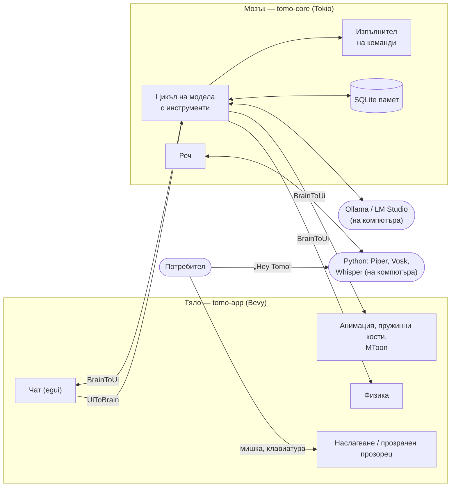
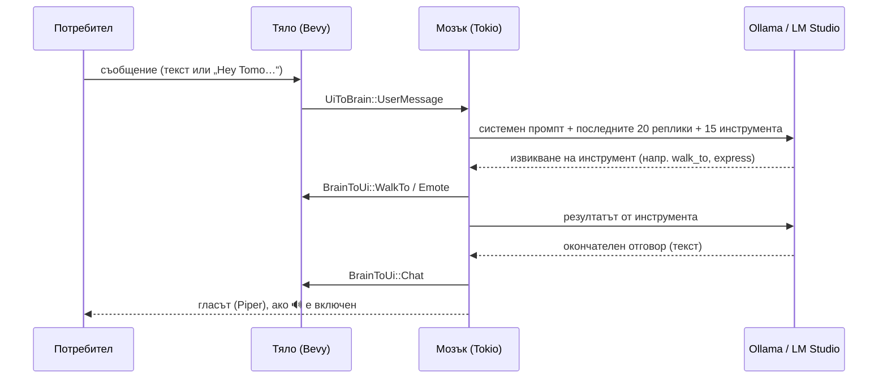

# Tomo — локален AI компаньон за работния плот (Linux и Windows)

**Техническа документация**

| | |
|---|---|
| **Проект** | Tomo — 3D персонаж (VRM), който живее върху работния плот и се управлява от изкуствен интелект, работещ на самия компютър |
| **Автор** | NodeVortex ([github.com/NodeVortexGit](https://github.com/NodeVortexGit)) |
| **Хранилище** | [github.com/NodeVortexGit/Tomo](https://github.com/NodeVortexGit/Tomo) |
| **Езици** | Rust, WGSL (шейдъри), Python, Bash, PowerShell |
| **Платформи** | Linux (разработен и тестван на Arch Linux с Hyprland/Wayland) и Windows 10/11 |
| **Лиценз** | MIT |
| **Версия** | 0.1.0, септември 2026 г. |

---

## Съдържание

1. [Резюме](#1-резюме)
2. [Цели на проекта](#2-цели-на-проекта)
3. [Основни възможности](#3-основни-възможности)
4. [Използвани технологии](#4-използвани-технологии)
5. [Архитектура](#5-архитектура)
6. [Описание на модулите](#6-описание-на-модулите)
7. [Ключови алгоритми и решения](#7-ключови-алгоритми-и-решения)
8. [Инсталация](#8-инсталация)
9. [Конфигурация](#9-конфигурация)
10. [Ръководство за потребителя](#10-ръководство-за-потребителя)
11. [Сигурност и поверителност](#11-сигурност-и-поверителност)
12. [Тестване и качество](#12-тестване-и-качество)
13. [Производителност](#13-производителност)
14. [Известни ограничения](#14-известни-ограничения)
15. [Бъдещо развитие](#15-бъдещо-развитие)
16. [Заключение](#16-заключение)
- [Приложение А. Инструментите на изкуствения интелект](#приложение-а-инструментите-на-изкуствения-интелект)
- [Приложение Б. Структура на базата данни](#приложение-б-структура-на-базата-данни)

---

## 1. Резюме

**Tomo** е компаньон за работния плот на Linux и Windows: триизмерен
персонаж във формат VRM (например създаден с VRoid Studio), който живее върху
екрана. Той ходи по „пода“ — долния край на екрана (на Windows — лентата на
задачите), може да бъде хванат с мишката, разклатен и хвърлен. Сяда, ляга да
подремне и става сам. Разговаря с потребителя с текст и глас.

Всички решения се вземат от **езиков модел, който работи на самия компютър**
чрез **Ollama** или **LM Studio**. Моделът действа чрез механизма за
използване на инструменти (*tool use*): решава какво да каже, къде да отиде,
какво изражение да покаже, какво да запомни и кои команди да изпълни.
Програмата изпълнява решенията на модела.

**Всичко работи локално.** Гласът на Tomo е Piper, а думата за събуждане
„Hey Tomo“ и казаното от потребителя се разпознават с Vosk и Whisper. Няма
облачни услуги и API ключове. Нищо от казаното или показаното не напуска
компютъра.

Проектът е написан на **Rust** с игровия двигател **Bevy**, с малки помощни
скриптове на **Python** (реч), **Bash** и **PowerShell** (инсталация). Той се
състои от два компонента:

- **„мозък“** (`tomo-core`): езиковият модел и инструментите му, памет, реч,
  изпълнение на команди. Няма графични зависимости и е покрит с модулни
  тестове.
- **„тяло“** (`tomo-app`): изобразяване, физика, анимация и потребителски
  интерфейс.

---

## 2. Цели на проекта

1. **Персонаж, който не е прозорец.** Tomo плава над всички прозорци, без да
   пречи на работата: кликванията върху празните места преминават към
   прозорците отдолу.
2. **Правдоподобно движение.** Движението идва от малък физичен двигател, а не
   от предварително записани анимации. Персонажът пада, преобръща се, люлее се,
   когато го носят, и се изправя сам.
3. **Естествен разговор.** Текст и глас, дума за събуждане „Hey Tomo“ и синтез
   на реч.
4. **Изцяло локална работа.** Езиковият модел, разпознаването и синтезът на
   реч работят на компютъра на потребителя, без интернет и без API ключове.
5. **Linux и Windows.** Едно и също приложение работи на двете системи, с
   инсталатор за всяка.
6. **Дългосрочна памет.** Tomo помни предпочитанията и фактите за потребителя
   между отделните стартирания.
7. **Помощ с компютъра, безопасно и прозрачно.** Отваряне на приложения,
   превключване на Bluetooth, Wi‑Fi и звук, поглед към екрана при нужда. Всяко
   действие се записва и може да бъде забранено.
8. **Поддръжка на чужди модели.** Всеки VRM 1.0 модел се показва с неговите
   собствени настройки: скелет, изражения, пружинни кости, MToon осветяване.
9. **Ниско натоварване.** Персонажът е включен постоянно, затова в покой
   използва около 13% от едно процесорно ядро.

---

## 3. Основни възможности

### Персонаж и движение

- **Прозрачно наслагване над всички прозорци.** На Linux това е повърхност на
  протокола *wlr-layer-shell* (Hyprland, Sway, KDE). На Windows е прозрачен
  прозорец „винаги отгоре“. Мишката се улавя само от персонажа и от отворения
  чат.
- **Физика на твърдо тяло.** Персонажът може да бъде хванат за всяка точка. Хванат
  за краката, той виси с главата надолу. Може да бъде разклатен и хвърлен с
  въртене. Ако се приземи неправилно, пада, полежава и става.
- **Самостоятелен живот.** Когато никой не го занимава, персонажът се разхожда,
  сяда и подремва.
- **Анимация, управлявана от физиката.** Ръцете и краката висят и се люлеят,
  когато го носят. Издигат се при падане. Коленете поддават при приземяване.
  Тялото се накланя, когато тръгва.
- **Дишане, походка, мигане, емоции и жестове** (махане, кимане, свиване на
  рамене). Устата се движи, докато персонажът говори.
- **Пружинни кости** (*spring bones*). Косата се развява при хвърляне и пада
  надолу, когато персонажът виси. Полата и панделките се поклащат.
- **MToon осветяване.** Моделът изглежда така, както е създаден: цветове за
  сенките, рязка граница между светлина и сянка, ръбова светлина, отблясъци в
  косата и контури.

### Изкуствен интелект и разговор

- **Локален езиков модел** чрез Ollama (неговия собствен API) или LM Studio
  (OpenAI-съвместимия API). Tomo сам намира работещия сървър и локален модел.
- **15 инструмента**, с които моделът действа: ходене, изражения, жестове,
  памет, команди, приложения, поглед към екрана и други
  ([Приложение А](#приложение-а-инструментите-на-изкуствения-интелект)).
- **„Течен“ прозорец за чат.** Кликване върху персонажа го кара да отиде вдясно.
  От него израства капка, която се превръща в прозорец за чат с последните
  реплики от разговора.
- **Дългосрочна памет** в SQLite: предпочитания, факти, история на разговора.

### Реч (изцяло на компютъра)

- **„Hey Tomo“.** Думата за събуждане се разпознава с Vosk, а заявката се
  превръща в текст с Whisper. Може и с бутона „Talk“, без дума за събуждане.
- **Собствен глас.** Невронният синтез на реч Piper работи в помощен процес,
  който зарежда гласа веднъж. Markdown и емоджита не се четат на глас. Бутонът
  🔊 изключва гласа.

### Работа с компютъра

- **Каталог на инсталираните приложения**: на Linux от `.desktop` файловете
  (включително Flatpak), на Windows от преките пътища в менюто „Старт“.
- **Системни превключватели** (Bluetooth, Wi‑Fi, звук) на Linux. На Windows
  моделът използва PowerShell.
- **Изпълнение на команди** (bash на Linux, PowerShell на Windows), защитено с
  главен превключвател, черен списък от опасни команди, одитен журнал и
  ограничение на времето.
- **Поглед към екрана.** С разрешение и с модел, който вижда изображения,
  Tomo може да види екранна снимка. Всеки поглед се отбелязва в чата.

### Персонализация и инсталиране

- **Избор на персонаж** от менюто 👤 в чата, внос на произволен `.vrm` файл или
  просто молба към Tomo да се преоблече. Изборът се запомня.
- **Всички настройки** са на едно място — файла `.env`.
- **Инсталатори**: `install.sh` за Linux и `Tomo-Setup-<версия>.exe` за
  Windows.

---

## 4. Използвани технологии

| Технология | Версия | За какво се използва |
|---|---|---|
| **Rust** (издание 2021) | 1.98 | Основен език за двата компонента |
| **Bevy** | 0.15 | Игров двигател: ECS, изобразяване (wgpu: Vulkan, DirectX 12, OpenGL), glTF, скелетна анимация |
| **bevy_egui** / egui | 0.31 | Прозорецът за чат |
| **smithay-client-toolkit** | 0.19 | Linux/Wayland: layer-shell повърхност, мишка, клавиатура |
| **windows-sys** | 0.59 | Windows: позиция на курсора и работна площ на екрана |
| **WGSL** | — | Шейдърът за MToon осветяването |
| **Tokio** | 1 | Асинхронното изпълнение на „мозъка“ |
| **reqwest** (rustls) | 0.12 | HTTP заявки към локалния сървър на модела |
| **rusqlite** (вграден SQLite) | 0.32 | Дългосрочната памет |
| **serde / serde_json** | 1 | JSON: API на модела, glTF/VRM разширения |
| **image**, **base64** | 0.25 / 0.22 | Мащабиране и кодиране на екранни снимки |
| **dotenvy**, **directories** | — | Конфигурация от `.env`, папките на системата |
| **tracing** | — | Журнал на събитията |
| **Ollama** / **LM Studio** | — | Локалният сървър на езиковия модел |
| **Python 3** + **Piper** (piper-tts) | ≥ 1.3 | Гласът на Tomo |
| **Vosk** (+ модел small-en-us 0.15) | ≥ 0.3.41 | Откриване на „Hey Tomo“ |
| **faster-whisper** (+ модел base.en) | ≥ 1.1 | Превръщане на казаното в текст |
| **sounddevice** (PortAudio) | ≥ 0.4 | Микрофонът на Windows и macOS |
| **uv** | — | Създава Python средата при инсталация на Windows |
| **Inno Setup** | 6 | Инсталаторът за Windows |
| **GitHub Actions** | — | Тестове на Linux и Windows, сглобяване на инсталатора |

---

## 5. Архитектура

### 5.1. Два компонента: „мозък“ и „тяло“



Двата компонента не споделят състояние. Те обменят само съобщения по два
канала:

- **`UiToBrain`** — от тялото към мозъка. Примери: потребителят написа нещо
  (`UserMessage`), натисна „Talk“ (`StartVoiceInput`), избра персонаж
  (`ImportCharacter`), включи или изключи гласа (`SetVoice`) или затвори
  програмата (`Shutdown`).
- **`BrainToUi`** — от мозъка към тялото. Примери: нов ред в чата (`Chat`),
  „отиди до…“ (`WalkTo`), изражение (`Emote`), жест (`Animate`), „мисля“
  (`Thinking`), „слушам“ (`Listening`), „говоря“ (`Speaking`), зареди модел
  (`LoadCharacter`), списък с персонажи (`Characters`).

Така цикълът на изобразяване никога не чака модела, базата данни или речта.

### 5.2. Нишки и процеси

| Нишка / процес | Какво прави |
|---|---|
| **Главна нишка** | Bevy. На Wayland — собствен цикъл върху събитията (calloop) вместо winit. На Windows и X11 — winit. |
| **Нишка за изобразяване** | Подготвя и изпраща кадрите към видеокартата (конвейерно изобразяване в Bevy). |
| **Нишка „tomo-brain“** | Tokio с 2 работни нишки: заявки към модела, база данни, команди, реч. |
| **`wake_word.py`** | Python процес за гласовия вход: „Hey Tomo“ и „Talk“. Връща разпознатия текст по JSON редове. |
| **`tts_piper.py`** | Python процес за гласа: зарежда гласа веднъж и превръща всеки ред текст в WAV файл. |
| **Ollama / LM Studio** | Отделна програма на същия компютър, която изпълнява езиковия модел. |

### 5.3. Структура на хранилището

```
tomo/
├── install.sh                 # инсталатор за Linux (apt / dnf / pacman / zypper)
├── .env.example               # образец на настройките, с обяснения
├── packaging/windows/         # инсталаторът за Windows (Inno Setup) и скриптовете му
├── .github/workflows/         # CI: тестове на Linux и Windows, инсталаторът
├── crates/
│   ├── tomo-core/             # МОЗЪКЪТ — без графика, с модулни тестове
│   │   ├── src/
│   │   │   ├── config.rs      #  зареждане на .env и папките на системата
│   │   │   ├── db.rs          #  SQLite памет
│   │   │   ├── ai.rs          #  цикълът на локалния модел с инструменти
│   │   │   ├── characters.rs  #  наличните .vrm модели и смяната им
│   │   │   ├── apps.rs        #  приложения (+ системни превключватели на Linux)
│   │   │   ├── commands.rs    #  защитеното изпълнение на команди
│   │   │   ├── screen.rs      #  екранни снимки за модела
│   │   │   ├── speech.rs      #  гласът на Tomo (Piper)
│   │   │   ├── wake.rs        #  гласовият вход: „Hey Tomo“ и „Talk“
│   │   │   ├── platform.rs    #  разликите между Linux и Windows
│   │   │   ├── events.rs      #  съобщенията между мозъка и тялото
│   │   │   └── brain.rs       #  главният цикъл на мозъка
│   │   └── examples/ask.rs    #  проверка на модела и гласа от терминала
│   └── tomo-app/              # ТЯЛОТО — приложение на Bevy
│       └── src/
│           ├── main.rs        #  сглобяване на приложението
│           ├── overlay.rs     #  прозрачното наслагване (Linux, Wayland)
│           ├── window.rs      #  прозорецът на Windows и X11
│           ├── session.rs     #  разпознаване на средата
│           ├── character.rs   #  зареждане и измерване на VRM модела
│           ├── movement.rs    #  физиката
│           ├── animation.rs   #  скелет, пози, изражения
│           ├── springs.rs     #  пружинните кости
│           ├── mtoon.rs       #  MToon материалът
│           ├── mtoon.wgsl     #  MToon шейдърът
│           ├── chat.rs        #  прозорецът за чат
│           ├── input.rs       #  „видими“ кликвания (по избор)
│           └── bridge.rs      #  каналите мозък ⇄ тяло
├── scripts/
│   ├── tts_piper.py           # гласът: текст → WAV (Piper)
│   ├── wake_word.py           # „Hey Tomo“ и „Talk“ (Vosk + Whisper)
│   ├── setup_models.py        # изтегляне на моделите за реч
│   └── requirements.txt
└── assets/characters/         # VRM моделите
```

---

## 6. Описание на модулите

### 6.1. Мозъкът (`tomo-core`)

| Модул | Описание |
|---|---|
| **`config.rs`** | Чете `.env` и променливите на средата. Попълва стойности по подразбиране и папките на системата (`~/.local/share/tomo` на Linux, `%APPDATA%\tomo\tomo\data` на Windows). Ключовете никога не се записват в журнала. |
| **`db.rs`** | SQLite база данни с предпочитания, спомени (с важност 1–5), история на разговора, персонажи и кеш на каталога ([Приложение Б](#приложение-б-структура-на-базата-данни)). |
| **`ai.rs`** | Цикълът с инструменти ([7.5](#75-цикълът-на-модела-с-инструменти)). Намира сървъра (Ollama, после LM Studio) и локален модел. Сглобява системния промпт (характер, операционна система, предпочитания, най-важните 15 спомена, наличните приложения) и историята (последните 20 реплики). Изпълнява поисканите инструменти и връща резултатите им, докато моделът не даде окончателен отговор (най-много 6 кръга). |
| **`characters.rs`** | Намира наличните `.vrm` модели в папката на зададения персонаж, в папката с данни, в `assets/characters` и в базата данни. Сменя персонажа и запомня избора. При нова инсталация показва приложения с програмата модел. |
| **`apps.rs`** | Каталог на приложенията: на Linux от `.desktop` файловете, на Windows от преките пътища в менюто „Старт“ (без деинсталаторите). На Linux проверява кои програми за превключватели има: `rfkill` или `bluetoothctl` за Bluetooth, `nmcli` за Wi‑Fi, `wpctl` или `pactl` за звук. Сканира при стартиране и след това периодично, само при промяна. |
| **`commands.rs`** | Изпълнителят на команди: главен превключвател, твърд черен списък с правила за Linux и за Windows, одитен журнал, 20-секундно ограничение ([раздел 11](#11-сигурност-и-поверителност)). |
| **`screen.rs`** | Прави екранна снимка: на Windows чрез .NET през PowerShell, на macOS с `screencapture`, на Linux с първия работещ инструмент (grim, spectacle, gnome-screenshot, maim, scrot, import). Смалява я до най-много 1920 px и я кодира като JPEG. |
| **`speech.rs`** | Гласът: поддържа работещ помощния процес `tts_piper.py`, праща му текста и възпроизвежда получения WAV файл (PipeWire/PulseAudio/ALSA на Linux, вградения звуков плейър на Windows). Преди синтеза `speakable()` премахва Markdown маркерите и емоджитата. |
| **`wake.rs`** | Стартира и наблюдава `wake_word.py`. Изпраща му команди (`listen`, `mute`, `unmute`) и получава разпознатия текст. Ако думата за събуждане е изключена, процесът отваря микрофона само при натискане на „Talk“. |
| **`platform.rs`** | Разликите между системите: коя обвивка изпълнява командите (bash или PowerShell), търсене на програми, пътят до Python в средата и стартиране на помощни процеси без конзолен прозорец на Windows. |
| **`events.rs`** | Типовете съобщения `UiToBrain` и `BrainToUi`, редът в чата `ChatLine` и `CharacterChoice`. |
| **`brain.rs`** | Главният цикъл: получава съобщенията от тялото, вика модела, записва репликите, пуска гласа във фонов режим и сканира приложенията. |

### 6.2. Тялото (`tomo-app`)

| Модул | Описание |
|---|---|
| **`main.rs`** | Сглобява приложението на Bevy. Грижи се да работи само едно копие. Пуска системите последователно в една нишка ([раздел 13](#13-производителност)). На Windows работи като графично приложение без конзола и пише журнала във файл. Намира `.env` до програмата и приема `--renderer` за смяна на графичния API. |
| **`overlay.rs`** | Само на Linux: повърхност на слоя *Overlay* от wlr-layer-shell, закотвена към четирите края на екрана. Собствен цикъл замества winit. Областта, която приема мишката, е кутията на персонажа и отвореният чат, а докато персонажът е хванат — целият екран. |
| **`window.rs`** | Прозорецът на Windows и X11: без рамка, прозрачен, винаги отгоре, без бутон в лентата на задачите. На Windows покрива работната площ (екрана без лентата на задачите). Включва приемането на мишката само докато курсорът е над персонажа или чата — иначе кликванията стигат до прозорците отдолу. В покой пада на 24 кадъра в секунда. |
| **`session.rs`** | Разпознава средата: Windows, macOS или на Linux X11/Wayland и работния плот (KDE, GNOME, XFCE, Cinnamon, Hyprland, i3, Sway). |
| **`character.rs`** | Зарежда `.vrm` файла със стандартния glTF зареждач на Bevy. Измерва модела, мащабира го до 320 px височина и го показва чак след измерването. |
| **`movement.rs`** | Физичният двигател ([7.1](#71-физичен-двигател)): тялото, крайниците, влаченето и хвърлянето, самостоятелният живот. |
| **`animation.rs`** | Чете скелета и изразите от VRM файла (`VRMC_vrm`). Всеки кадър поставя костите в поза и управлява лицето. |
| **`springs.rs`** | Пружинните кости (`VRMC_springBone`), [7.3](#73-пружинни-кости). |
| **`mtoon.rs`, `mtoon.wgsl`** | MToon материалът и шейдърът (`VRMC_materials_mtoon`), [7.4](#74-mtoon--анимационното-осветяване-на-vrm). |
| **`chat.rs`** | Последователността кликване → ходене → „течна“ капка → прозорец. Самият прозорец: история, поле за текст, „Send“, „Talk“, 👤, 🔊, „Quit“ и ×. Прозорецът за избор на файл е zenity/kdialog на Linux и стандартният на Windows. |
| **`input.rs`** | „Видими“ кликвания и писане от името на модела, по избор (`--features control`). |
| **`bridge.rs`** | Всеки кадър изпразва канала от мозъка и превръща съобщенията в събития на Bevy. |

---

## 7. Ключови алгоритми и решения

### 7.1. Физичен двигател

Персонажът е **твърдо тяло в равнината на екрана**, с координати в логически
пиксели, начало горе вляво и ос *y* надолу. Тялото има център на масата,
скорост, ъгъл на завъртане и ъглова скорост. Ъгълът не е ограничен, така че
персонажът може да се завърти напълно.

**Стойки (състояния):**

| Стойка | Поведение |
|---|---|
| `Standing` | Стои на крака. Ходи към цел с ускорение и спиране и се накланя в посоката на ускорението. |
| `Sitting` | Седи на пода, обърнат три четвърти към средата на екрана. |
| `Lying` | Лежи — съборен или подремва. |
| `Rolling` | Изправя се или ляга (0.9 s). |
| `Flying` | Свободно тяло във въздуха: гравитация, съпротивление на въздуха, въртене. |
| `Carried` | Виси от точката, за която е хванат, като махало. |

**Удари.** Във въздуха тялото е **капсула**, която се удря в пода, стените и
тавана. Ударите се решават с **импулси**, с еластичност 0.3 и кулоново триене
0.5. Всеки кадър се разделя на подстъпки от най-много 1/240 s, за да е
симулацията стабилна при всяка кадрова честота.

**Приземяване.** Персонажът се приземява на крака само ако наклонът е под
0.6 rad, въртенето е под 6 rad/s и скоростта е под 2400 px/s. Иначе пада,
полежава 1.5–3 s и става.

**Носене и хвърляне.** Точката на хващане се запомня в собствената отправна
система на тялото. Тялото виси от нея като махало със затихване 0.9 s⁻¹, така
че хванат за краката персонажът виси с главата надолу. Скоростта на мишката се
изглажда. При пускане тялото отлита с нея (до 3000 px/s) и с въртенето, което
е имало (до 25 rad/s).

**Самостоятелен живот.** На всеки 4–10 секунди персонажът избира какво да
прави: разходка (50%), сядане (12%, за 6–15 s), дрямка (8%, за 10–25 s) или
просто остава прав (30%).

| Величина | Стойност |
|---|---|
| Гравитация | 2200 px/s² |
| Скорост на ходене / ускорение | 200 px/s / 1200 px/s² |
| Скорост на скок | 750 px/s (≈ 130 px височина) |
| Височина на персонажа | 320 px |
| Център на масата | 0.55 × височината над стъпалата |
| Радиус на капсулата | 0.12 × височината |
| Инерционен момент (на единица маса) | 0.09 × височината² |

### 7.2. Анимация, управлявана от физиката

Позите се задават в **нормализиран скелет**, както в библиотеката three-vrm.
Завъртането *Q* на всяка кост е в осите на модела спрямо T-позата. То се
превръща в собствената отправна система на костта по формулата:

```
локално = P⁻¹ · Q · P · L
```

където *P* е завъртането на родителя в покой, а *L* е завъртането на костта в
покой. Затова една и съща поза пасва на всеки VRM 1.0 модел, независимо от
осите на костите му.

**Крайниците** са махала в *усещаното поле*: гравитацията минус ускорението на
тялото, плюс съпротивлението на въздуха. Затова ръцете и краката висят и се
люлеят, когато персонажът е носен, издигат се при падане и изостават при рязко
потегляне. При приземяване коленете поддават пропорционално на скоростта на
удара и после се изправят.

**Лицето** се управлява чрез *morph targets* (blend shapes) от VRM изразите:
мигане на случайни интервали, емоции (радост, тъга, гняв, изненада,
спокойствие), които избледняват след 8 s, и движение на устата, докато звучи
гласът.

Ходенето е обвързано с изминатото разстояние: един цикъл от две стъпки е 0.8
от височината. Затова стъпките никога не „се плъзгат“.

### 7.3. Пружинни кости

Косата, полите и панделките са описани във VRM файла като **вериги от стави**
(`VRMC_springBone`) с твърдост, съпротивление и гравитация. Сблъсъците с
тялото се описват със сфери и капсули. Върхът на всяка кост е частица с
**интегриране на Верле**, на фиксирани стъпки от 1/60 s:

```
инерция  = (връх − предишен_връх) × (1 − съпротивление)
следващ  = връх + инерция + (посока_в_покой × твърдост + гравитация) × Δt
следващ  = глава + нормирано(следващ − глава) × дължина_на_костта
следващ  = изтласкан извън сферите и капсулите на тялото
```

- **Косата се симулира в световното пространство.** При хвърляне тя се
  развява, а когато персонажът виси с главата надолу, пада надолу.
- **Дрехите се симулират в пространството, което моделът посочва**, както ги
  е настроил авторът. Така полата не се вдига при хвърляне.
- Системата се изпълнява **след** като Bevy е пресметнал позицията на костите
  за кадъра и сама записва крайните им трансформации. Затова люлеенето се вижда
  в същия кадър.

### 7.4. MToon — анимационното осветяване на VRM

VRM моделите описват за всеки материал **MToon** настройки
(`VRMC_materials_mtoon`), а за съвместимост ги маркират и като „неосветени“.
Tomo прочита MToon настройките, заменя материалите със собствен материал и
изобразява модела със собствен WGSL шейдър:

```
засенчване = linearstep(−1 + toony, 1 − toony, N·L + отместване)
цвят       = смес(цвят_на_сянката, основен_цвят, засенчване) × светлина
           + основен_цвят × околна_светлина
           + (matcap + ръбова_светлина) × смес(1, светлина, rimLightingMix)
           + излъчване
```

- **Сянка и светлина** с граница, чиято рязкост определя `toony`.
- **Ръбова светлина**, **matcap** и **излъчване** (оттам е златистият отблясък
  в косата).
- **Прозрачните части на лицето** се рисуват в реда, зададен от модела.
- **Контури.** Мрежата се рисува втори път, разширена по нормалите, като се
  виждат само задните ѝ страни. Контурът се поддържа поне около 0.8 px широк.

### 7.5. Цикълът на модела с инструменти



- **Откриване.** Ако `.env` не посочва сървър, Tomo проверява Ollama
  (`127.0.0.1:11434`), после LM Studio (`127.0.0.1:1234`). Избира посочения
  модел или първия локален модел за чат (пропуска облачните модели на Ollama
  и моделите за вграждане). Изборът се помни, докато сървърът отговаря.
- **Два API.** С Ollama Tomo говори на неговия собствен API, в който задава и
  колко от разговора да чете моделът (`num_ctx`). С LM Studio и всеки друг
  сървър използва OpenAI-съвместимия API.
- **Устойчивост с малки модели.** Някои модели пишат извикванията на
  инструменти в текста (`<tool_call>{…}</tool_call>` или само JSON). Tomo ги
  разпознава и изпълнява. Бележките в `<think>…</think>` не влизат в
  отговора. Ако моделът не вижда изображения, разговорът продължава без
  екранната снимка.
- **Без сървър** Tomo казва на потребителя как да го пусне и какъв модел да
  изтегли.

### 7.6. „Hey Tomo“ и „Talk“ — гласов вход

1. `wake_word.py` чете микрофона (16 kHz, моно): на Linux чрез
   parecord/pw-record/arecord, на Windows чрез PortAudio (`sounddevice`).
   Vosk го разпознава с граматика, ограничена до няколко фрази („hey tomo“,
   „hi tomo“ и др.), което е бързо и пести процесора.
2. При откриване Tomo подскача и отваря чата с надпис „Listening…“.
3. Заявката се записва до края на говора (до 15 s). Превръща се в текст с
   Whisper (base.en, int8), с подсказка за думата „Tomo“.
4. Текстът постъпва в мозъка като обикновено съобщение.

С изключена дума за събуждане процесът не слуша постоянно: отваря микрофона
само докато бутонът „Talk“ записва. Докато Tomo говори, слушането е заглушено.

### 7.7. Над всички прозорци: Wayland и Windows

- **Linux (Wayland).** Повърхността е на най-горния слой (*Overlay*) и покрива
  целия монитор. Прозрачна е (предварително умножена алфа), а мишката се
  приема само в кутията на персонажа и в отворения чат.
- **Windows.** Прозорецът е прозрачен чрез DWM, винаги отгоре и без бутон в
  лентата на задачите. Покрива работната площ, така че лентата на задачите
  е подът. Всеки кадър Tomo проверява позицията на курсора и включва
  приемането на мишката само над персонажа или чата. Навсякъде другаде
  кликванията стигат до прозорците отдолу. Ако драйверът на видеокартата
  рисува фона черен, Tomo може да рисува с OpenGL или DirectX 12 вместо Vulkan
  (`--renderer`, `TOMO_RENDERER`).
- **Кадрова честота.** При движение кадрите следват монитора, а в покой са 24
  в секунда.

---

## 8. Инсталация

### 8.1. Модел, с който Tomo мисли

Трябва сървър на модела на компютъра:

- **[Ollama](https://ollama.com/download)** и модел, например
  `ollama pull qwen2.5:7b`; или
- **[LM Studio](https://lmstudio.ai)** — изтеглете модел и пуснете локалния
  сървър.

Препоръчани модели (добри в използването на инструменти): с видеокарта с
8 GB (напр. RTX 3070) — `qwen2.5:7b` или `llama3.1:8b`; на по-слаби машини —
`qwen2.5:3b` или `llama3.2:3b`. За поглед към екрана трябва модел, който вижда
изображения, напр. `qwen2.5vl:7b` или `gemma3`.

### 8.2. Windows

1. Инсталирайте Ollama (или LM Studio).
2. Пуснете **`Tomo-Setup-<версия>.exe`** — от страницата
   [Releases](https://github.com/NodeVortexGit/Tomo/releases) или като
   артефакт `Tomo-Setup-windows` от последното изпълнение на
   [Build](https://github.com/NodeVortexGit/Tomo/actions). Инсталира се само
   за текущия потребител (без администраторски права). По желание:
   - настройва гласа и „Hey Tomo“: собствена Python среда с Piper, Vosk и
     Whisper и моделите им (около 1 GB, еднократно);
   - изтегля `qwen2.5:7b` за Ollama (около 4.7 GB).
3. Стартирайте **Tomo** от менюто „Старт“. Настройките са в „Tomo settings“.

Ако фонът на персонажа е черен вместо прозрачен, стартирайте **Tomo
(compatibility)** (рисува с OpenGL) или задайте `TOMO_RENDERER=gl` (или
`dx12`) в настройките.

### 8.3. Linux

```bash
git clone https://github.com/NodeVortexGit/Tomo.git tomo
cd tomo
./install.sh
```

`install.sh`:

1. разпознава пакетния мениджър (apt, dnf, pacman, zypper) и инсталира
   системните библиотеки;
2. инсталира Rust чрез rustup, ако липсва;
3. създава Python средата `scripts/.venv` с Piper, Vosk и Whisper;
4. изтегля моделите за реч (около 250 MB) с `setup_models.py`;
5. компилира програмата и я инсталира в `~/.local/bin/tomo` с пряк път в
   менюто на приложенията;
6. създава `.env` от образеца;
7. проверява за Ollama или LM Studio и предлага да изтегли модел за Ollama.

Опции: `TOMO_SKIP_SYSDEPS=1`, `TOMO_NO_BUILD=1`, `TOMO_PREFIX=…`,
`TOMO_MODEL=…` (моделът за Ollama).

Проверка на модела и гласа без графика:

```bash
cargo run -p tomo-core --example ask -- --speak "кажи здравей"
```

---

## 9. Конфигурация

Всички настройки са във файла `.env` (образец:
[`.env.example`](../../.env.example)). Стойностите по подразбиране работят.

| Ключ | По подразбиране | Описание |
|---|---|---|
| `TOMO_LLM` | `auto` | `auto` (Ollama, иначе LM Studio), `ollama`, `lmstudio` или `openai` (друг OpenAI-съвместим сървър) |
| `TOMO_LLM_URL` | обичайният адрес | напр. `http://127.0.0.1:11434` или `http://127.0.0.1:1234/v1` |
| `TOMO_LLM_MODEL` | първият локален модел | напр. `qwen2.5:7b` |
| `TOMO_LLM_CONTEXT` | `8192` | колко от разговора чете моделът, в токени (Ollama) |
| `TOMO_LLM_API_KEY` | — | само ако сървърът изисква ключ |
| `TOMO_TTS_VOICE` | `en_US-lessac-medium` | гласът на Piper |
| `TOMO_TTS_SPEED` | `1.0` | скорост на речта |
| `TOMO_WAKE_WORD` | `true` | слушане за „Hey Tomo“ |
| `TOMO_WHISPER_DEVICE` | `cpu` | `cuda` за видеокарта NVIDIA (с CUDA 12 и cuDNN 9) |
| `TOMO_PERSONA` | `Tomo` | името на персонажа |
| `TOMO_CHARACTER` | приложеният модел | `.vrm` за показване |
| `TOMO_OUTPUT` | — | на кой монитор (Linux, Wayland) |
| `TOMO_RENDERER` | най-добрият наличен | `vulkan`, `dx12` или `gl` |
| `TOMO_ALLOW_COMMANDS` | `true` | главният превключвател за команди и управление |
| `TOMO_ALLOW_SCREEN` | `true` | може ли моделът да вижда екрана |
| `TOMO_DATA_DIR` | папката на системата | папката с данни (памет, модели, журнали) |

---

## 10. Ръководство за потребителя

| Действие | Как |
|---|---|
| **Отваряне на чата** | Кликнете върху персонажа. Той отива вдясно и чатът „изтича“ от него. |
| **Затваряне на чата** | Бутонът ×, клавишът Escape, кликване другаде или ново кликване върху персонажа. |
| **Писане** | Напишете в полето „Say something…“ и натиснете Enter или „Send“. |
| **Говорене** | Кажете „Hey Tomo, …“ или натиснете „Talk“. |
| **Без глас** | Изключете 🔊 в горната част на чата. |
| **Смяна на персонажа** | Менюто 👤 → изберете модел, или „Import a .vrm…“ за нов файл. Може и с думи. |
| **Хващане и хвърляне** | Натиснете върху персонажа, влачете и пуснете в движение. |
| **С главата надолу** | Хванете го за краката и го вдигнете. |
| **Изход** | Бутонът „Quit“ в чата. |
| **Спешно спиране на управлението** | Ctrl+Alt+Esc или клавишът Pause. |
| **Черен фон (Windows)** | Стартирайте „Tomo (compatibility)“ или задайте `TOMO_RENDERER=gl`. |

Примери за молби към Tomo (на английски, защото „Hey Tomo“ разпознава
английски):

- „Wave at me!“ — маха.
- „Sit down for a bit.“ — сяда на пода.
- „What's this error on my screen?“ — поглежда екрана (отбелязва го в чата)
  и обяснява.
- „Open Firefox.“ — стартира приложението.
- „Remember that I'm learning Rust.“ — запомня го за следващите разговори.

---

## 11. Сигурност и поверителност

### Поверителност — всичко остава на компютъра

- **Езиковият модел работи на компютъра** (Ollama / LM Studio). Съобщенията,
  спомените и екранните снимки отиват само при него.
- **Гласът — входящ и изходящ — също е локален**: Vosk, Whisper и Piper.
- **Екранни снимки** се правят само при разрешение (`TOMO_ALLOW_SCREEN`), и
  всеки поглед се отбелязва в чата.
- **Интернет** е нужен само при инсталацията (моделите за реч, модел за
  Ollama) и при първото използване на нов глас на Piper.
- **Паметта** е локален SQLite файл в папката с данни.

### Изпълнение на команди — четири защитни слоя

1. **Главен превключвател.** При `TOMO_ALLOW_COMMANDS=false` нищо не се
   изпълнява. Записва се само какво би било изпълнено.
2. **Твърд черен списък**, който не може да се изключи от `.env`.
   - **Linux:** рекурсивно изтриване на корена, форматиране (`mkfs`), запис
     директно върху диск, „fork bomb“, изтегляне от мрежата направо в shell.
   - **Windows:** форматиране и изтриване на дискове и дялове (`format`,
     `Format-Volume`, `Clear-Disk`, `diskpart`), промени в зареждането
     (`bcdedit`), изтриване на цял диск или на системните папки, изтриване на
     резервните копия (`vssadmin delete shadows`), изтриване на системни
     ключове в регистъра, изпълнение на изтеглен код (`iwr … | iex`).
3. **Одитен журнал.** Всяка команда се записва с час в
   `command-audit.log` в папката с данни.
4. **Ограничение на времето.** След 20 s командата се прекратява.

„Видимите“ кликвания се компилират само по изрично желание
(`--features control`), с червен знак, докато траят, и спешен клавиш за
спиране.

---

## 12. Тестване и качество

### Модулни тестове — 72 теста

```bash
cargo test --workspace
```

| Модул | Брой | Какво се проверява |
|---|---|---|
| `ai` | 14 | Реда на репликите; търсенето на Ollama, после LM Studio; избора на локален модел (без облачни модели и модели за вграждане); заявките в двата API (контекст, изображения, извиквания на инструменти); четенето на отговорите; `<think>` бележките; извикванията, написани в текста; пълен кръг с фалшив сървър Ollama и фалшив LM Studio; съобщението, когато няма сървър |
| `apps` | 7 | `.desktop` файлове; преките пътища в менюто „Старт“ (без деинсталатори и повторения); търсене; „отпечатък“ |
| `characters` | 4 | Моделите от папките; запомняне на избора; копиране на файл отвън; моделът при нова инсталация |
| `commands` | 6 | Обикновени команди; опасните команди на Linux и на Windows се отказват; нормалните команди на Windows се пропускат; главният превключвател; улавяне на изхода |
| `db` | 4 | Предпочитания, спомени, хронология, един активен персонаж |
| `platform` | 2 | Търсене на програми; изпълнение в обвивката на системата |
| `screen` | 3 | Смаляване и кодиране на екранни снимки |
| `speech` | 4 | Markdown, емоджита, списъци и връзки не се четат на глас |
| `movement` | 16 | Приземяване, ходене, скок, завъртане, падане и ставане, хвърляне, висене, сядане, лягане, крайници, 39 случайни сценария по 2 минути самостоятелен живот |
| `springs` | 6 | Разбор на веригите; покой; връщане и успокояване; косата пада, когато персонажът виси; изтласкване от сблъсъците |
| `mtoon` | 3 | Разбор на MToon настройките; стойности по подразбиране; сглобяване на материала |
| `session` | 3 | Разпознаване на X11/Wayland и работната среда |

### Непрекъсната интеграция (GitHub Actions)

При всяко изпращане в GitHub
[`.github/workflows/build.yml`](../../.github/workflows/build.yml) изпълнява
`cargo clippy` (без нито едно предупреждение) и всички тестове **на Linux и на
Windows**. После компилира програмата за Windows и сглобява инсталатора
(Inno Setup). При етикет на версия (`v0.2.0` и т.н.) инсталаторът се прикача
към издание (release) в GitHub.

### Ръчни тестове

- **Локален модел.** Цял разговор с истински локален модел в Ollama, по
  неговия API и по OpenAI-съвместимия. Гласът на Piper е синтезиран във файл,
  без звук.
- **Графика.** Проверена е с виртуална мишка и екранни снимки. За да не се
  пречи на потребителя, тестовете се изпълняват на временен виртуален монитор
  (*headless output*).

---

## 13. Производителност

Персонажът е включен постоянно, затова натоварването е важно. Измерено на
Linux, на Intel Core i5-1235U с Iris Xe:

| Мярка | Процесор (едно ядро) |
|---|---|
| Първоначална версия, по всяко време | ≈ 67% |
| Адаптивна кадрова честота (24 fps в покой) + 3 нишки | ≈ 26% в покой |
| Системите на Bevy се изпълняват последователно в една нишка | **≈ 13% в покой** |
| С пружинни кости и MToon (включително контурите) | ≈ 13% в покой |

Езиковият модел, разпознаването и синтезът на реч работят в отделни
процеси (Ollama / LM Studio, Python) и натоварват компютъра само докато Tomo
мисли, слуша или говори. С видеокарта от типа на RTX 3070 модел с 7–8
милиарда параметъра отговаря за секунди.

---

## 14. Известни ограничения

- **Windows.** Програмата се компилира и минава тестовете на Windows. Но
  поведението на работния плот (прозрачност, преминаване на кликванията,
  гласът) още не е проверено на истински компютър с Windows. Прозрачността
  зависи от драйвера на видеокартата — при черен фон вижте раздел 8.2.
- Останалите среди на Linux освен Hyprland се поддържат в кода, но не са
  тествани. **GNOME на Wayland** няма layer-shell и не позволява прозорец
  „винаги отгоре“.
- На X11 и GNOME кликванията не минават през празните места на прозореца.
- **HiDPI** (мащаб на екрана над 1) не е тестван.
- **VRM 0.x** моделите се показват, но не се анимират.
- **„Hey Tomo“** разпознава само английски. Малките модели (0.5–3 милиарда
  параметъра) правят повече грешки при използване на инструменти.
- „Течната“ капка е съставена от кръгове, а не от истински течен шейдър.

---

## 15. Бъдещо развитие

- Проверка и настройка на поведението на истински компютри с Windows.
- Разпознаване на думата за събуждане и на заявките на български език.
- Шейдър за течността (метатопки / SDF).
- Поддръжка на VRM 0.x модели.
- Ходене между няколко монитора; мащаб на екрана над 1.
- Още жестове и поведения при самостоятелния живот.

---

## 16. Заключение

Tomo съчетава няколко области:

- езиков модел, който работи на самия компютър и взема решенията чрез
  инструменти;
- собствен физичен двигател за твърдо тяло;
- процедурна анимация, управлявана от физиката;
- симулация на пружинни кости;
- собствена реализация на MToon осветяването;
- локално разпознаване и синтез на реч;
- прозрачно наслагване над прозорците на Linux и Windows.

Резултатът е персонаж, който не прилича на програма, а на „жив“ обитател на
работния плот. Той реагира на мишката по физически правдоподобен начин,
разговаря, помни и помага, като остава безопасен, прозрачен в действията си,
лек за системата и изцяло поверителен: всичко се случва на компютъра на
потребителя.

---

## Приложение А. Инструментите на изкуствения интелект

| Инструмент | Какво прави |
|---|---|
| `execute_command` | Изпълнява команда (bash на Linux, PowerShell на Windows) през защитения изпълнител. Изходът отива само при модела. |
| `remember` | Запомня факт за потребителя (с вид и важност 1–5). |
| `set_preference` | Запазва предпочитание като ключ и стойност (напр. име). |
| `recall` | Търси в дългосрочната памет. |
| `walk_to` | Отива до позиция на екрана (0.0 = ляв край, 1.0 = десен край). |
| `express` | Изражение: neutral, happy, sad, surprised, angry, relaxed. |
| `animate` | Жест или действие: wave, nod, shrug, sit, lie_down, jump, idle. |
| `change_character` | Сменя модела. Без име връща списъка. |
| `list_apps` | Търси в инсталираните приложения. |
| `open_app` | Стартира приложение. |
| `click_at` | Отива до точка от екрана и кликва (при разрешено управление). |
| `type_text` | Пише текст от клавиатурата (при разрешено управление). |
| `toggle_system` | Превключва Bluetooth, Wi‑Fi или звука (Linux). |
| `look_at_screen` | Прави екранна снимка и я показва на модела (при `TOMO_ALLOW_SCREEN`). |
| `find_on_screen` | Екранна снимка с цел, чиито координати моделът разчита за `click_at`. |

## Приложение Б. Структура на базата данни

Файл: `memory.sqlite3` в папката с данни (`~/.local/share/tomo` на Linux,
`%APPDATA%\tomo\tomo\data` на Windows).

| Таблица | Колони | Предназначение |
|---|---|---|
| `preferences` | `key`, `value`, `updated_at` | Предпочитания на потребителя |
| `memories` | `id`, `kind`, `content`, `importance`, `created_at` | Спомени (факти, проекти, харесвания) |
| `messages` | `id`, `role`, `content`, `at_ms` | История на разговора |
| `characters` | `id`, `name`, `path`, `added_at`, `is_active` | Внесени и избрани персонажи |
| `snapshots` | `key`, `fingerprint`, `json`, `updated_at` | Кеш на каталога с приложения |
